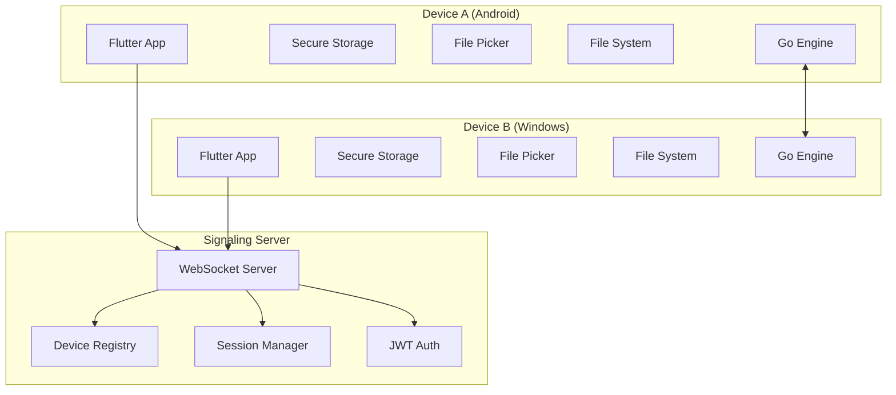
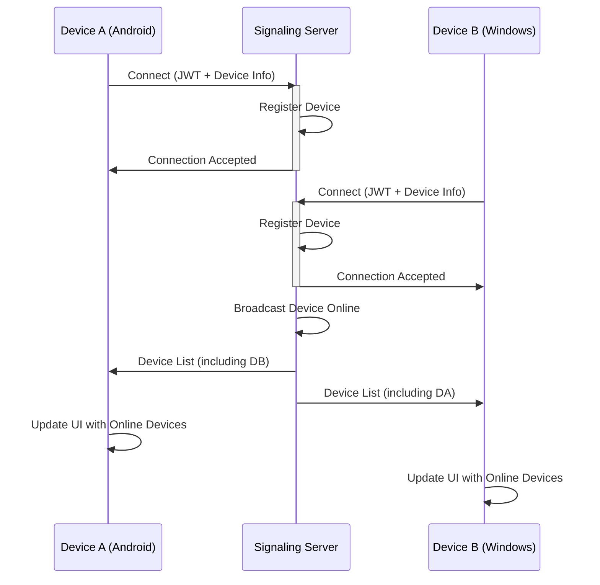
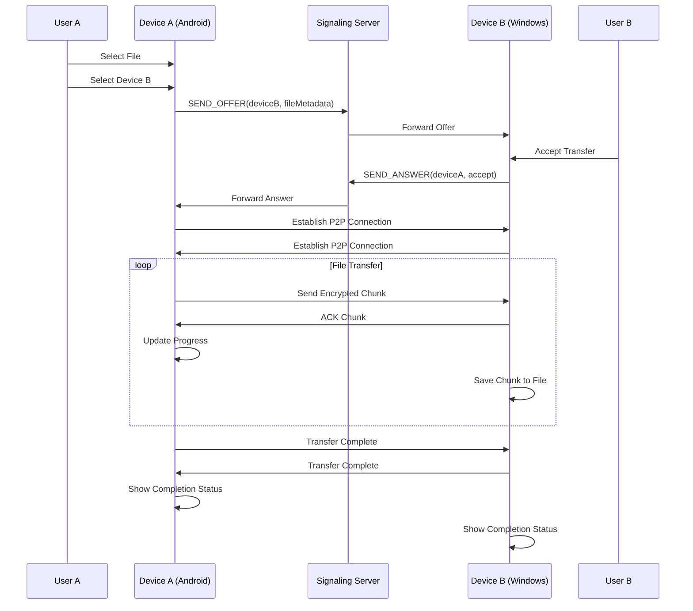
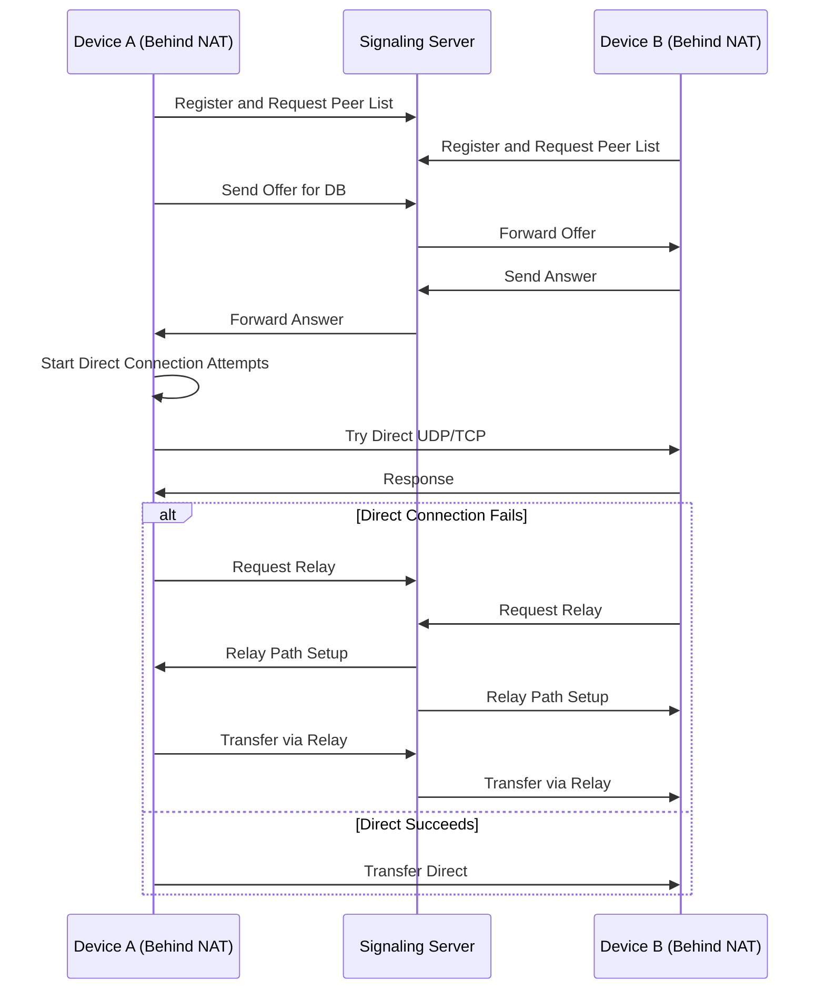

# Project_Roadmap

```markdown
# PROJECT_ROADMAP.md

# Secure Cross-Platform Decentralized File Sharing System

## Version: 1.0.0
## Last Updated: July 19, 2026
## Status: Active Development

---

# TABLE OF CONTENTS

1. [Project Overview](#1-project-overview)
2. [Architecture](#2-architecture)
3. [Technology Stack](#3-technology-stack)
4. [Repository Structure](#4-repository-structure)
5. [GitHub Project Setup](#5-github-project-setup)
6. [Branching Strategy](#6-branching-strategy)
7. [Coding Standards](#7-coding-standards)
8. [Learning Roadmap](#8-learning-roadmap)
9. [Weekly Roadmap](#9-weekly-roadmap)
10. [Integration Plan](#10-integration-plan)
11. [Testing Roadmap](#11-testing-roadmap)
12. [Documentation Roadmap](#12-documentation-roadmap)
13. [Feature Completion Matrix](#13-feature-completion-matrix)
14. [Risk Register](#14-risk-register)
15. [Buffer Weeks](#15-buffer-weeks)
16. [Final Month](#16-final-month)
17. [Final Submission Checklist](#17-final-submission-checklist)

---

# 1. PROJECT OVERVIEW

## 1.1 Vision

To create a secure, decentralized, cross-platform file sharing system that enables users to transfer files directly between devices without relying on central servers for file storage. The system prioritizes security, privacy, and user control, making it suitable for both personal and enterprise use cases.

## 1.2 Objectives

### Primary Objectives
1. **Secure File Transfer**: Implement end-to-end encryption for all file transfers
2. **Cross-Platform Support**: Enable seamless transfers between Android and Windows devices
3. **Decentralized Architecture**: Minimize server dependency for file transfers
4. **User-Friendly Interface**: Provide an intuitive Flutter-based UI
5. **Real-Time Communication**: Implement WebSocket-based signaling for device discovery

### Secondary Objectives
1. **NAT Traversal**: Support devices behind firewalls and NATs
2. **Multiple File Support**: Allow batch file transfers
3. **Transfer Resumption**: Support for paused/resumed transfers
4. **Transfer History**: Track and manage previous transfers
5. **Multi-Device Support**: Simultaneous transfers to multiple devices

## 1.3 MVP (Minimum Viable Product)

| Feature | Priority | Description |
|---------|----------|-------------|
| Device Discovery | P0 | Find nearby devices via signaling server |
| Single File Transfer | P0 | Transfer one file at a time |
| End-to-End Encryption | P0 | All transfers must be encrypted |
| Basic UI | P0 | Functional screens for file selection and transfer |
| Transfer Progress | P0 | Show real-time progress of file transfers |
| Authentication | P0 | Secure JWT-based device authentication |
| Signaling Server | P0 | WebSocket server for device coordination |
| Android Support | P0 | Primary target platform |
| Windows Support | P0 | Secondary target platform |

## 1.4 Stretch Goals

| Feature | Priority | Description |
|---------|----------|-------------|
| Folder Transfer | P1 | Transfer entire folders |
| Multiple Files | P1 | Select and transfer multiple files simultaneously |
| Transfer History | P2 | Track and view past transfers |
| Transfer Resumption | P2 | Resume interrupted transfers |
| Multi-Device Transfers | P2 | Transfer to multiple devices at once |
| Linux Support | P2 | Additional platform support |
| Transfer Notifications | P3 | System notifications for transfers |
| Dark Mode | P3 | Theme support |
| Language Support | P3 | Multi-language UI |
| Transfer Speed Control | P3 | User-controlled bandwidth limits |
| Transfer Queue | P3 | Queue multiple transfers |

## 1.5 Scope

### In Scope
- Flutter-based mobile and desktop application
- Node.js signaling server with WebSocket support
- Go-based core file transfer engine
- End-to-end encryption for file transfers
- JWT-based device authentication
- Real-time transfer progress tracking
- Device discovery via signaling server
- File selection from device storage
- Secure storage of preferences and credentials

### Out of Scope
- Cloud storage integration
- Social media sharing
- File preview (videos, documents)
- Chat functionality
- User accounts (device-based identity only)
- Transfer over cellular data (WiFi-first approach)
- Mobile-to-Web transfers
- P2P video/voice calls
- Server-side file storage
- Native file system integration (beyond file picker)

## 1.6 Non-Goals

| Item | Rationale |
|------|-----------|
| Cloud Backup | Focus on direct device-to-device transfers |
| Social Features | No social network integration |
| Media Streaming | Only file transfer, not streaming |
| Mobile Network Optimization | WiFi-first approach |
| File Indexing | No file system indexing |
| User Management | Device identity model only |
| Subscription Model | Free and open source |

---

# 2. ARCHITECTURE

## 2.1 System Architecture Overview

### 2.1.1 High-Level Architecture Diagram



### 2.1.2 System Components

| Component | Technology | Responsibility |
|-----------|------------|----------------|
| Frontend | Flutter | User interface, device discovery, file selection |
| Core Engine | Go | File transfer, encryption, networking |
| Signaling Server | Node.js/Express | Device registration, session management |
| WebSocket Server | ws | Real-time communication |
| Secure Storage | flutter_secure_storage | Store credentials and preferences |
| File System Access | file_picker, path_provider | File selection and storage |

## 2.2 Communication Flow

### 2.2.1 Device Discovery Flow



### 2.2.2 File Transfer Flow



### 2.2.3 NAT Traversal Flow



## 2.3 Data Models

### 2.3.1 Device Model

```typescript
interface Device {
    id: string;                 // Unique device identifier (UUID)
    name: string;               // User-defined device name
    type: 'android' | 'windows' | 'linux';
    platform: string;           // OS version
    ipAddress: string;          // Public IP address
    localIp: string;            // Local network IP
    port: number;               // Listening port
    publicKey: string;          // Public key for encryption
    lastSeen: Date;             // Last connection timestamp
    isOnline: boolean;          // Current online status
    avatarUrl?: string;         // Optional avatar
    capabilities: {
        supportsFolder: boolean;
        supportsBatch: boolean;
        maxFileSize: number;
    };
}
```

### 2.3.2 Transfer Model

```typescript
interface Transfer {
    id: string;                 // Transfer ID
    deviceId: string;           // Target device ID
    fileName: string;           // Original filename
    filePath: string;           // Full file path
    fileSize: number;           // Size in bytes
    fileHash: string;           // SHA-256 hash
    status: 'pending' | 'inProgress' | 'paused' | 'completed' | 'failed' | 'cancelled';
    direction: 'send' | 'receive';
    progress: number;           // 0-100
    transferSpeed: number;      // Bytes per second
    startTime: Date;
    endTime?: Date;
    errorMessage?: string;
    chunkSize: number;          // Dynamic chunk size
    retryCount: number;
}
```

### 2.3.3 Session Model

```typescript
interface Session {
    sessionId: string;          // Unique session ID
    deviceId: string;           // Connected device ID
    token: string;              // JWT token
    connectedAt: Date;
    lastActivity: Date;
    isActive: boolean;
    ipAddress: string;
    userAgent: string;
}
```

### 2.3.4 Signaling Message Types

```typescript
type SignalingMessageType = 
    | 'REGISTER'
    | 'UNREGISTER'
    | 'GET_DEVICES'
    | 'SEND_OFFER'
    | 'SEND_ANSWER'
    | 'SEND_ICE_CANDIDATE'
    | 'LEAVE'
    | 'KEEP_ALIVE'
    | 'ERROR'
    | 'DEVICE_UPDATE';

interface SignalingMessage {
    type: SignalingMessageType;
    deviceId: string;
    timestamp: number;
    payload: any;
    correlationId?: string;
}
```

## 2.4 Protocol Design

### 2.4.1 File Transfer Protocol

| Field | Size | Description |
|-------|------|-------------|
| Version | 1 byte | Protocol version (v1) |
| Type | 1 byte | Message type (SYN, ACK, DATA, FIN) |
| Flags | 2 bytes | Control flags |
| Transfer ID | 16 bytes | Unique transfer identifier |
| Chunk Number | 8 bytes | Current chunk number |
| Total Chunks | 8 bytes | Total number of chunks |
| Chunk Size | 4 bytes | Size of this chunk in bytes |
| Checksum | 32 bytes | SHA-256 hash of chunk data |
| Data | Variable | Encrypted chunk data |

### 2.4.2 Signaling Protocol

| Message Type | Description | Payload |
|--------------|-------------|---------|
| REGISTER | Register device | Device info object |
| UNREGISTER | Deregister device | None |
| GET_DEVICES | Request device list | None |
| SEND_OFFER | Initiate transfer | Offer details |
| SEND_ANSWER | Respond to offer | Answer details |
| SEND_ICE_CANDIDATE | Exchange ICE candidates | Candidate details |
| KEEP_ALIVE | Maintain connection | Timestamp |

## 2.5 Folder Structure

```
secure_p2p_transfer/
├── frontend/                          # Flutter Application
│   ├── android/                       # Android specific
│   ├── windows/                       # Windows specific
│   ├── lib/
│   │   ├── main.dart                  # App entry point
│   │   ├── app/
│   │   │   ├── app.dart              # App configuration
│   │   │   └── routes.dart           # Navigation routes
│   │   ├── models/                   # Data models
│   │   │   ├── device.dart
│   │   │   ├── transfer.dart
│   │   │   └── settings.dart
│   │   ├── viewmodels/               # Business logic
│   │   │   ├── device_viewmodel.dart
│   │   │   ├── transfer_viewmodel.dart
│   │   │   └── settings_viewmodel.dart
│   │   ├── views/                    # UI screens
│   │   │   ├── home_screen.dart
│   │   │   ├── device_discovery.dart
│   │   │   ├── file_picker.dart
│   │   │   ├── transfer_screen.dart
│   │   │   └── settings_screen.dart
│   │   ├── widgets/                  # Reusable components
│   │   │   ├── progress_indicator.dart
│   │   │   ├── device_card.dart
│   │   │   └── transfer_item.dart
│   │   ├── services/                 # External services
│   │   │   ├── websocket_service.dart
│   │   │   ├── transfer_service.dart
│   │   │   ├── encryption_service.dart
│   │   │   └── storage_service.dart
│   │   ├── repositories/             # Data access
│   │   │   ├── device_repository.dart
│   │   │   └── transfer_repository.dart
│   │   └── utils/                    # Utilities
│   │       ├── constants.dart
│   │       ├── helpers.dart
│   │       └── extensions.dart
│   ├── assets/
│   │   ├── images/
│   │   └── fonts/
│   └── pubspec.yaml
│
├── backend/                          # Node.js Signaling Server
│   ├── src/
│   │   ├── app.ts                   # App entry
│   │   ├── controllers/
│   │   │   ├── authController.ts
│   │   │   ├── deviceController.ts
│   │   │   └── websocketController.ts
│   │   ├── services/
│   │   │   ├── authService.ts
│   │   │   ├── deviceService.ts
│   │   │   ├── signalingService.ts
│   │   │   └── sessionService.ts
│   │   ├── models/
│   │   │   ├── device.ts
│   │   │   ├── session.ts
│   │   │   └── signaling.ts
│   │   ├── middleware/
│   │   │   ├── auth.ts
│   │   │   ├── logging.ts
│   │   │   └── errorHandler.ts
│   │   ├── routes/
│   │   │   ├── apiRoutes.ts
│   │   │   └── websocketRoutes.ts
│   │   ├── config/
│   │   │   ├── config.ts
│   │   │   └── database.ts
│   │   └── utils/
│   │       ├── logger.ts
│   │       └── validator.ts
│   ├── tests/
│   │   ├── unit/
│   │   ├── integration/
│   │   └── e2e/
│   ├── dist/                        # Compiled JS
│   ├── package.json
│   ├── tsconfig.json
│   └── .env.example
│
├── core/                            # Go Core Engine
│   ├── cmd/
│   │   └── engine/
│   │       └── main.go             # Entry point
│   ├── pkg/
│   │   ├── crypto/                 # Encryption
│   │   │   ├── encryption.go
│   │   │   └── hash.go
│   │   ├── network/                # Networking
│   │   │   ├── tcp.go
│   │   │   ├── udp.go
│   │   │   └── websocket.go
│   │   ├── transfer/               # File transfer
│   │   │   ├── sender.go
│   │   │   ├── receiver.go
│   │   │   └── chunk.go
│   │   ├── protocol/               # Protocol definitions
│   │   │   ├── message.go
│   │   │   └── handshake.go
│   │   └── utils/
│   │       ├── file.go
│   │       └── logger.go
│   ├── internal/                   # Internal packages
│   │   ├── config/
│   │   └── constants/
│   ├── api/                        # API definitions
│   │   ├── grpc/                   # Optional gRPC
│   │   └── http/                   # HTTP handlers
│   ├── test/
│   ├── go.mod
│   └── go.sum
│
├── infrastructure/                  # DevOps & Deployment
│   ├── docker/
│   │   ├── backend/
│   │   │   └── Dockerfile
│   │   ├── core/
│   │   │   └── Dockerfile
│   │   └── docker-compose.yml
│   ├── kubernetes/                 # Kubernetes manifests
│   │   ├── backend/
│   │   ├── core/
│   │   └── ingress/
│   └── terraform/                  # Infrastructure as Code
│
├── docs/                           # Documentation
│   ├── architecture/
│   │   ├── system-architecture.md
│   │   ├── component-diagram.md
│   │   └── data-flow.md
│   ├── api/
│   │   ├── rest-api.md
│   │   └── websocket-protocol.md
│   ├── protocol/
│   │   ├── file-transfer.md
│   │   └── signaling.md
│   ├── deployment/
│   │   ├── docker.md
│   │   └── ci-cd.md
│   ├── user/
│   │   ├── user-manual.md
│   │   └── installation.md
│   ├── developer/
│   │   ├── setup-guide.md
│   │   └── coding-standards.md
│   ├── uml/
│   │   ├── sequence-diagrams.md
│   │   └── class-diagram.md
│   ├── weekly-checkpoints/         # Weekly documentation
│   │   ├── week-01.md
│   │   ├── week-02.md
│   │   └── ...
│   └── resources/
│       └── learning-resources.md
│
├── scripts/                        # Automation scripts
│   ├── build/
│   ├── deploy/
│   └── test/
│
├── .github/                        # GitHub configuration
│   ├── workflows/
│   │   ├── ci.yml
│   │   ├── cd.yml
│   │   ├── weekly-update.yml
│   │   └── security-scan.yml
│   ├── ISSUE_TEMPLATE/
│   │   ├── bug_report.md
│   │   ├── feature_request.md
│   │   └── weekly_checkpoint.md
│   └── PULL_REQUEST_TEMPLATE.md
│
├── .gitignore
├── .gitattributes
├── LICENSE
├── README.md
├── PROJECT_ROADMAP.md              # This file
├── LEARNING_ROADMAP.md             # Extended learning guide
├── CONTRIBUTING.md
└── SECURITY.md
```

---

# 3. TECHNOLOGY STACK

## 3.1 Frontend: Flutter

| Technology | Version | Purpose |
|------------|---------|---------|
| Flutter | 3.16+ | Cross-platform UI framework |
| Dart | 3.2+ | Programming language |
| Riverpod | 2.4+ | State management |
| flutter_secure_storage | 9.0+ | Secure credential storage |
| file_picker | 6.0+ | File selection |
| path_provider | 2.1+ | File system access |
| connectivity_plus | 5.0+ | Network connectivity |
| web_socket_channel | 2.4+ | WebSocket client |

**Why Flutter?**
- Single codebase for Android and Windows
- Rich widget library for native-looking UI
- Strong community support
- Excellent performance
- Built-in Material Design and Cupertino support
- Active development and documentation
- Good integration with platform-specific features

## 3.2 Backend: Node.js

| Technology | Version | Purpose |
|------------|---------|---------|
| Node.js | 20.x | Runtime environment |
| TypeScript | 5.x | Programming language |
| Express | 4.18+ | HTTP framework |
| ws | 8.14+ | WebSocket server |
| jsonwebtoken | 9.0+ | JWT authentication |
| bcrypt | 5.1+ | Password hashing |
| dotenv | 16.0+ | Environment variables |
| winston | 3.11+ | Logging |
| express-validator | 7.0+ | Request validation |
| helmet | 7.0+ | Security headers |
| cors | 2.8+ | CORS support |
| uuid | 9.0+ | Unique identifiers |

**Why Node.js?**
- Excellent for real-time applications
- Event-driven, non-blocking I/O
- Large ecosystem of packages
- Good WebSocket support
- Easy to learn and implement
- Fast development cycle
- Strong TypeScript support

## 3.3 Core Engine: Go

| Technology | Version | Purpose |
|------------|---------|---------|
| Go | 1.21+ | Programming language |
| crypto/tls | Standard | TLS encryption |
| crypto/aes | Standard | Symmetric encryption |
| crypto/sha256 | Standard | Hashing |
| net | Standard | Networking |
| io | Standard | I/O operations |
| os | Standard | File system |
| sync | Standard | Concurrency |
| encoding/binary | Standard | Binary encoding |

**Why Go?**
- Excellent concurrency support
- High performance for network operations
- Built-in cryptography
- Efficient memory management
- Strong standard library
- Easy cross-compilation
- Great for low-level networking
- Fast execution speed

## 3.4 Infrastructure

| Technology | Purpose |
|------------|---------|
| Docker | Containerization |
| Docker Compose | Multi-container orchestration |
| GitHub Actions | CI/CD automation |
| Wireshark | Network debugging |
| Postman | API testing |
| Bruno | API testing |
| Mermaid | Diagram creation |
| MkDocs | Documentation generation |

## 3.5 Security Stack

| Layer | Technology | Purpose |
|-------|------------|---------|
| Transport | TLS 1.3 | Secure communication |
| Application | AES-256-GCM | File encryption |
| Authentication | JWT | Device authentication |
| Storage | flutter_secure_storage | Secure credential storage |
| Hashing | SHA-256 | File integrity verification |
| Key Exchange | ECDH | Secure key exchange |

---

# 4. REPOSITORY STRUCTURE

## 4.1 Complete Repository Tree

```
secure-p2p-transfer/
│
├── frontend/                                    [Rahul's Domain]
│   ├── android/
│   │   ├── app/
│   │   ├── gradle/
│   │   └── settings.gradle
│   ├── windows/
│   │   ├── runner/
│   │   └── CMakeLists.txt
│   ├── lib/
│   │   ├── main.dart
│   │   ├── app/
│   │   │   ├── app.dart
│   │   │   ├── routes.dart
│   │   │   └── theme.dart
│   │   ├── models/
│   │   │   ├── device.dart
│   │   │   ├── transfer.dart
│   │   │   ├── settings.dart
│   │   │   └── user.dart
│   │   ├── viewmodels/
│   │   │   ├── auth_viewmodel.dart
│   │   │   ├── device_viewmodel.dart
│   │   │   ├── transfer_viewmodel.dart
│   │   │   ├── settings_viewmodel.dart
│   │   │   └── home_viewmodel.dart
│   │   ├── views/
│   │   │   ├── screens/
│   │   │   │   ├── home_screen.dart
│   │   │   │   ├── device_discovery.dart
│   │   │   │   ├── file_picker_screen.dart
│   │   │   │   ├── transfer_screen.dart
│   │   │   │   ├── transfer_history.dart
│   │   │   │   ├── settings_screen.dart
│   │   │   │   ├── about_screen.dart
│   │   │   │   └── onboarding_screen.dart
│   │   │   └── widgets/
│   │   │       ├── common/
│   │   │       │   ├── app_bar.dart
│   │   │       │   ├── drawer.dart
│   │   │       │   └── bottom_nav_bar.dart
│   │   │       ├── device/
│   │   │       │   ├── device_card.dart
│   │   │       │   ├── device_list.dart
│   │   │       │   └── device_status_indicator.dart
│   │   │       ├── transfer/
│   │   │       │   ├── progress_bar.dart
│   │   │       │   ├── transfer_item.dart
│   │   │       │   ├── transfer_list.dart
│   │   │       │   └── speed_indicator.dart
│   │   │       └── dialogs/
│   │   │           ├── confirmation_dialog.dart
│   │   │           ├── error_dialog.dart
│   │   │           └── success_dialog.dart
│   │   ├── services/
│   │   │   ├── websocket/
│   │   │   │   ├── websocket_service.dart
│   │   │   │   ├── websocket_manager.dart
│   │   │   │   └── message_handler.dart
│   │   │   ├── transfer/
│   │   │   │   ├── transfer_service.dart
│   │   │   │   ├── file_transfer.dart
│   │   │   │   └── chunk_manager.dart
│   │   │   ├── encryption/
│   │   │   │   ├── encryption_service.dart
│   │   │   │   └── key_manager.dart
│   │   │   ├── storage/
│   │   │   │   ├── secure_storage.dart
│   │   │   │   └── local_storage.dart
│   │   │   ├── connectivity/
│   │   │   │   └── connectivity_service.dart
│   │   │   └── network/
│   │   │       └── network_scanner.dart
│   │   ├── repositories/
│   │   │   ├── device_repository.dart
│   │   │   ├── transfer_repository.dart
│   │   │   └── settings_repository.dart
│   │   ├── providers/
│   │   │   ├── providers.dart
│   │   │   ├── device_provider.dart
│   │   │   ├── transfer_provider.dart
│   │   │   ├── settings_provider.dart
│   │   │   └── auth_provider.dart
│   │   ├── utils/
│   │   │   ├── constants/
│   │   │   │   ├── app_constants.dart
│   │   │   │   ├── api_constants.dart
│   │   │   │   └── error_codes.dart
│   │   │   ├── helpers/
│   │   │   │   ├── format_helper.dart
│   │   │   │   ├── validation_helper.dart
│   │   │   │   └── file_helper.dart
│   │   │   ├── extensions/
│   │   │   │   ├── context_extensions.dart
│   │   │   │   ├── string_extensions.dart
│   │   │   │   └── list_extensions.dart
│   │   │   └── mixins/
│   │   │       ├── loading_mixin.dart
│   │   │       └── error_handler_mixin.dart
│   │   └── config/
│   │       ├── app_config.dart
│   │       └── environment.dart
│   ├── assets/
│   │   ├── images/
│   │   │   ├── logo.png
│   │   │   └── icons/
│   │   ├── fonts/
│   │   │   └── google_fonts/
│   │   └── translations/
│   │       ├── en.json
│   │       └── hi.json
│   ├── test/
│   │   ├── unit/
│   │   │   ├── models/
│   │   │   ├── viewmodels/
│   │   │   └── services/
│   │   ├── widgets/
│   │   └── integration/
│   ├── pubspec.yaml
│   ├── pubspec.lock
│   ├── analysis_options.yaml
│   └── flutter_launcher_icons.yaml
│
├── backend/                                    [Laxmikant's Domain]
│   ├── src/
│   │   ├── app.ts
│   │   ├── server.ts
│   │   ├── controllers/
│   │   │   ├── authController.ts
│   │   │   ├── deviceController.ts
│   │   │   ├── transferController.ts
│   │   │   ├── sessionController.ts
│   │   │   ├── healthController.ts
│   │   │   └── websocketController.ts
│   │   ├── services/
│   │   │   ├── authService.ts
│   │   │   ├── deviceService.ts
│   │   │   ├── signalingService.ts
│   │   │   ├── sessionService.ts
│   │   │   ├── messageService.ts
│   │   │   ├── relayService.ts
│   │   │   └── metricsService.ts
│   │   ├── models/
│   │   │   ├── device.ts
│   │   │   ├── session.ts
│   │   │   ├── signaling.ts
│   │   │   ├── relay.ts
│   │   │   └── dto/
│   │   │       ├── deviceDto.ts
│   │   │       ├── signalingDto.ts
│   │   │       └── authDto.ts
│   │   ├── middleware/
│   │   │   ├── auth.ts
│   │   │   ├── logging.ts
│   │   │   ├── cors.ts
│   │   │   ├── rateLimit.ts
│   │   │   ├── validation.ts
│   │   │   └── errorHandler.ts
│   │   ├── routes/
│   │   │   ├── apiRoutes.ts
│   │   │   ├── authRoutes.ts
│   │   │   ├── deviceRoutes.ts
│   │   │   └── websocketRoutes.ts
│   │   ├── config/
│   │   │   ├── config.ts
│   │   │   ├── database.ts
│   │   │   ├── logging.ts
│   │   │   └── security.ts
│   │   ├── utils/
│   │   │   ├── logger.ts
│   │   │   ├── validator.ts
│   │   │   ├── encryption.ts
│   │   │   ├── jwt.ts
│   │   │   └── constants.ts
│   │   └── types/
│   │       ├── express.d.ts
│   │       └── websocket.d.ts
│   ├── tests/
│   │   ├── unit/
│   │   │   ├── services/
│   │   │   └── controllers/
│   │   ├── integration/
│   │   │   ├── api/
│   │   │   └── websocket/
│   │   └── fixtures/
│   ├── dist/
│   ├── logs/
│   ├── package.json
│   ├── package-lock.json
│   ├── tsconfig.json
│   ├── .env.example
│   ├── .eslintrc.js
│   ├── .prettierrc
│   └── nodemon.json
│
├── core/                                       [Swaraj's Domain]
│   ├── cmd/
│   │   └── engine/
│   │       └── main.go
│   ├── pkg/
│   │   ├── crypto/
│   │   │   ├── encryption.go
│   │   │   ├── encryption_test.go
│   │   │   ├── hash.go
│   │   │   ├── key_exchange.go
│   │   │   └── certificate.go
│   │   ├── network/
│   │   │   ├── tcp/
│   │   │   │   ├── connection.go
│   │   │   │   ├── listener.go
│   │   │   │   └── dialer.go
│   │   │   ├── udp/
│   │   │   │   ├── connection.go
│   │   │   │   └── socket.go
│   │   │   ├── websocket/
│   │   │   │   ├── client.go
│   │   │   │   └── server.go
│   │   │   └── nat/
│   │   │       ├── traversal.go
│   │   │       └── stun.go
│   │   ├── transfer/
│   │   │   ├── sender.go
│   │   │   ├── sender_test.go
│   │   │   ├── receiver.go
│   │   │   ├── chunk.go
│   │   │   ├── manager.go
│   │   │   ├── progress.go
│   │   │   └── resume.go
│   │   ├── protocol/
│   │   │   ├── message.go
│   │   │   ├── handshake.go
│   │   │   ├── frame.go
│   │   │   └── codec.go
│   │   ├── utils/
│   │   │   ├── file.go
│   │   │   ├── file_test.go
│   │   │   ├── logger.go
│   │   │   ├── errors.go
│   │   │   └── retry.go
│   │   └── api/
│   │       └── grpc/
│   │           ├── api.proto
│   │           └── generated/
│   ├── internal/
│   │   ├── config/
│   │   │   ├── config.go
│   │   │   └── defaults.go
│   │   └── constants/
│   │       └── constants.go
│   ├── test/
│   │   ├── integration/
│   │   ├── e2e/
│   │   └── fixtures/
│   ├── go.mod
│   ├── go.sum
│   ├── Makefile
│   └── .golangci.yml
│
├── infrastructure/                            [Vaibhav's Domain]
│   ├── docker/
│   │   ├── backend/
│   │   │   └── Dockerfile
│   │   ├── core/
│   │   │   └── Dockerfile
│   │   ├── frontend/
│   │   │   └── Dockerfile
│   │   ├── docker-compose.yml
│   │   ├── docker-compose.dev.yml
│   │   └── docker-compose.prod.yml
│   ├── kubernetes/
│   │   ├── backend/
│   │   │   ├── deployment.yml
│   │   │   ├── service.yml
│   │   │   └── configmap.yml
│   │   ├── core/
│   │   │   ├── deployment.yml
│   │   │   └── service.yml
│   │   ├── frontend/
│   │   │   ├── deployment.yml
│   │   │   └── service.yml
│   │   ├── ingress.yml
│   │   └── secrets.yml
│   └── terraform/
│       ├── main.tf
│       ├── variables.tf
│       └── outputs.tf
│
├── docs/                                      [Vaibhav's Documentation Domain]
│   ├── index.md
│   ├── architecture/
│   │   ├── system-architecture.md
│   │   ├── component-diagram.md
│   │   ├── data-flow.md
│   │   └── deployment-architecture.md
│   ├── api/
│   │   ├── rest-api.md
│   │   ├── websocket-protocol.md
│   │   └── error-codes.md
│   ├── protocol/
│   │   ├── file-transfer-protocol.md
│   │   ├── signaling-protocol.md
│   │   └── encryption-protocol.md
│   ├── deployment/
│   │   ├── local-development.md
│   │   ├── docker-deployment.md
│   │   ├── kubernetes-deployment.md
│   │   └── ci-cd-pipeline.md
│   ├── user/
│   │   ├── user-manual.md
│   │   ├── installation-guide.md
│   │   └── troubleshooting.md
│   ├── developer/
│   │   ├── getting-started.md
│   │   ├── coding-standards.md
│   │   ├── testing-guide.md
│   │   └── contributing.md
│   ├── uml/
│   │   ├── sequence-diagrams.md
│   │   ├── class-diagrams.md
│   │   └── use-case-diagrams.md
│   ├── weekly-checkpoints/
│   │   ├── week-01.md
│   │   ├── week-02.md
│   │   ├── week-03.md
│   │   ├── week-04.md
│   │   ├── week-05.md
│   │   ├── week-06.md
│   │   ├── week-07.md
│   │   ├── week-08.md
│   │   ├── week-09.md
│   │   ├── week-10.md
│   │   ├── week-11.md
│   │   ├── week-12.md
│   │   ├── week-13.md
│   │   ├── week-14.md
│   │   ├── week-15.md
│   │   ├── week-16.md
│   │   ├── week-17.md
│   │   ├── week-18.md
│   │   ├── week-19.md
│   │   └── week-20.md
│   └── resources/
│       └── learning-resources.md
│
├── scripts/                                    [Vaibhav's Automation Domain]
│   ├── build/
│   │   ├── build-frontend.sh
│   │   ├── build-backend.sh
│   │   └── build-core.sh
│   ├── deploy/
│   │   ├── deploy-local.sh
│   │   └── deploy-production.sh
│   ├── test/
│   │   ├── run-tests.sh
│   │   └── security-scan.sh
│   └── git/
│       └── hooks/
│           └── pre-commit
│
├── .github/
│   ├── workflows/
│   │   ├── ci.yml
│   │   ├── cd.yml
│   │   ├── weekly-update.yml
│   │   ├── security-scan.yml
│   │   ├── codeql-analysis.yml
│   │   └── dependency-review.yml
│   ├── ISSUE_TEMPLATE/
│   │   ├── bug_report.md
│   │   ├── feature_request.md
│   │   ├── weekly_checkpoint.md
│   │   └── security_vulnerability.md
│   └── PULL_REQUEST_TEMPLATE.md
│
├── .gitignore
├── .gitattributes
├── .editorconfig
├── .pre-commit-config.yaml
├── LICENSE
├── README.md
├── PROJECT_ROADMAP.md
├── LEARNING_ROADMAP.md
├── CONTRIBUTING.md
├── SECURITY.md
├── CODE_OF_CONDUCT.md
└── CHANGELOG.md
```

---

# 5. GITHUB PROJECT SETUP

## 5.1 Milestones

### Milestone 1: Foundation (Week 1-4)
- **Due Date:** August 16, 2026
- **Description:** Project setup, architecture design, learning phase
- **Success Criteria:**
  - All repositories initialized
  - Development environments set up
  - Learning resources completed
  - Basic project structure in place

### Milestone 2: Core Signaling (Week 5-8)
- **Due Date:** September 13, 2026
- **Description:** Signaling server, WebSocket connectivity, device discovery
- **Success Criteria:**
  - WebSocket server operational
  - Device registration working
  - Basic device discovery implemented
  - End-to-end WebSocket communication

### Milestone 3: File Transfer (Week 9-12)
- **Due Date:** October 11, 2026
- **Description:** File transfer implementation, encryption, progress
- **Success Criteria:**
  - End-to-end file transfer working
  - Encryption implemented
  - Progress tracking functional
  - Basic UI complete

### Milestone 4: Polish & Testing (Week 13-16)
- **Due Date:** November 8, 2026
- **Description:** Testing, optimization, error handling
- **Success Criteria:**
  - Comprehensive test coverage
  - Performance optimization
  - Robust error handling
  - Edge cases handled

### Milestone 5: Deployment (Week 17-20)
- **Due Date:** December 6, 2026
- **Description:** Production deployment, documentation, final polish
- **Success Criteria:**
  - Production deployment ready
  - Complete documentation
  - CI/CD pipeline operational
  - Final review complete

## 5.2 Project Board Configuration

### Columns

| Column | Description | WIP Limit |
|--------|-------------|-----------|
| 📋 Backlog | All planned tasks | Unlimited |
| 🎯 Sprint Planning | Next sprint tasks | 10/team |
| ⚡ In Progress | Currently working on | 3/person |
| 👀 Code Review | PRs under review | 5/team |
| ✅ Testing | QA in progress | 3/team |
| 🚀 Done | Completed tasks | Unlimited |

### Card Labels

| Label | Color | Use |
|-------|-------|-----|
| `critical` | 🔴 Red | Critical issues blocking release |
| `high-priority` | 🟠 Orange | Important features/bugs |
| `medium-priority` | 🟡 Yellow | Regular tasks |
| `low-priority` | 🟢 Green | Nice to have |
| `learning` | 🔵 Blue | Educational tasks |
| `research` | 🟣 Purple | Research tasks |
| `frontend` | 🎨 Pink | Flutter tasks |
| `backend` | 🌐 Teal | Node.js tasks |
| `core` | 🔒 Dark Gray | Go tasks |
| `devops` | ⚙️ Brown | Infrastructure tasks |
| `documentation` | 📚 Light Blue | Documentation tasks |
| `testing` | 🧪 Light Green | Testing tasks |
| `blocked` | ⛔ Black | Blocked tasks |
| `help-wanted` | ❓ Light Purple | Needs collaboration |
| `good-first-issue` | 🌱 Light Green | Beginner friendly |

## 5.3 Issue Templates

### Bug Report Template

```markdown
---
name: Bug Report
about: Create a bug report
title: "[BUG] Brief description of the issue"
labels: bug
assignees: ''
---

## 🐛 Bug Description
<!-- Clear and concise description of the bug -->

## 🔄 Steps to Reproduce
1. Go to '...'
2. Click on '...'
3. Scroll down to '...'
4. See error

## ✅ Expected Behavior
<!-- What should have happened -->

## 📱 Actual Behavior
<!-- What actually happened -->

## 🖥️ Environment
- OS: [e.g., Windows 10]
- Browser/App Version: [e.g., 1.0.0]
- Flutter/Node/Go Version: [e.g., Flutter 3.16]
- Device: [e.g., OnePlus 9]

## 📸 Screenshots
<!-- If applicable, add screenshots -->

## 📋 Additional Context
<!-- Any other relevant information -->

## 🔍 Possible Solution
<!-- Optional: suggest a fix -->

## 📊 Impact
- [ ] Critical - System down
- [ ] High - Major feature broken
- [ ] Medium - Feature partially broken
- [ ] Low - Minor issue
```

### Feature Request Template

```markdown
---
name: Feature Request
about: Suggest a feature
title: "[FEATURE] Brief description"
labels: enhancement
assignees: ''
---

## 🚀 Feature Description
<!-- Clear and concise description of the feature -->

## 💡 Problem Statement
<!-- What problem does this solve? -->

## 🎯 Use Case
<!-- Who will use this and how? -->

## 🔧 Proposed Solution
<!-- How should this be implemented? -->

## 📊 Acceptance Criteria
<!-- What conditions must be met? -->
- [ ] Criteria 1
- [ ] Criteria 2
- [ ] Criteria 3

## 📝 Additional Context
<!-- Any additional information -->

## 🏷️ Priority
- [ ] High
- [ ] Medium
- [ ] Low

## 📅 Timeline
<!-- Expected completion time -->
```

### Weekly Checkpoint Template

```markdown
---
name: Weekly Checkpoint
about: Weekly progress tracking
title: "[WEEK X] [NAME] - Progress Report"
labels: checkpoint
assignees: ''
---

## 📅 Week X: [Date Range]

### ✅ Completed This Week
- [ ] Task 1
- [ ] Task 2
- [ ] Task 3

### 🚧 In Progress
- [ ] Task 1
- [ ] Task 2

### 🎯 Next Week Goals
- [ ] Goal 1
- [ ] Goal 2

### 📊 Metrics
- Commits: #
- PRs Opened: #
- PRs Merged: #
- Lines of Code: +X / -Y
- Hours Spent: #

### 📚 Resources Used
- [Resource 1]
- [Resource 2]

### 🤔 Blockers/Challenges
- Issue 1
- Issue 2
- Mitigation Plan

### 🏆 Achievements
- What went well this week

### 🔮 Next Week Focus
- Primary focus area

### 📸 Screenshots/Demo
<!-- Add links or images -->

### 💬 Notes/Reflections
- Lessons learned:
- What could improve:
```

## 5.4 PR Template

```markdown
---
name: Pull Request
about: Submit a pull request
title: "[PR] Brief description"
labels: review
assignees: ''
---

## 📝 Summary
<!-- Brief description of changes -->

## 🎯 Related Issues
<!-- Link to related issues -->
Closes #[issue-number]

## 🔧 Changes Made
<!-- Detailed list of changes -->
- [ ] Change 1
- [ ] Change 2
- [ ] Change 3

## ✅ Checklist

### Code Quality
- [ ] Code follows coding standards
- [ ] Comments added where necessary
- [ ] Documentation updated
- [ ] No new warnings/errors

### Testing
- [ ] Unit tests added/updated
- [ ] Integration tests added/updated
- [ ] Manual testing performed
- [ ] Edge cases handled

### Security
- [ ] No sensitive data exposed
- [ ] Encryption properly implemented
- [ ] Authentication/authorization checked
- [ ] Input validation added

### Performance
- [ ] Performance impact assessed
- [ ] Memory usage optimized
- [ ] Network usage optimized

## 📸 Screenshots
<!-- If UI changes, include screenshots -->

## 🧪 How to Test
<!-- Steps to test the changes -->
1. Step 1
2. Step 2
3. Step 3

## 🔄 Dependencies
<!-- Any dependencies this PR has -->

## 📊 Impact
- [ ] Breaking change
- [ ] Feature addition
- [ ] Bug fix
- [ ] Documentation update

## 👀 Reviewer Notes
<!-- Any specific areas to focus on -->
```

## 5.5 Discussion Categories

| Category | Purpose |
|----------|---------|
| 📢 Announcements | Project-wide announcements |
| 🗣️ General Discussion | General conversation |
| 💡 Ideas | Feature suggestions and ideas |
| 🤔 Q&A | Questions and answers |
| 🐛 Bugs | Bug discussions |
| 📚 Resources | Sharing learning resources |
| 🔧 Implementation | Technical implementation discussions |
| 🎨 Design | UI/UX discussions |

## 5.6 Wiki Structure

```
Home
├── Getting Started
│   ├── Setup Guide
│   ├── Development Environment
│   └── Quick Start
├── Architecture
│   ├── System Overview
│   ├── Component Diagrams
│   └── Data Flow
├── Development
│   ├── Coding Standards
│   ├── Testing Guide
│   ├── Git Workflow
│   └── Code Review Process
├── Deployment
│   ├── Local Development
│   ├── Docker Deployment
│   └── Production Deployment
├── Documentation
│   ├── API Reference
│   ├── Protocol Documentation
│   └── User Manuals
└── Team
    ├── Team Members
    ├── Meeting Notes
    └── Weekly Updates
```

## 5.7 Release Strategy

### Versioning Scheme
```
v{major}.{minor}.{patch}
```

| Version | Type | Description |
|---------|------|-------------|
| v1.0.0 | Major | First stable release |
| v1.1.0 | Minor | Feature additions |
| v1.1.1 | Patch | Bug fixes |

### Release Schedule

| Version | Target Date | Features |
|---------|-------------|----------|
| v0.1.0-alpha | Week 8 | Basic signaling |
| v0.2.0-alpha | Week 12 | File transfer |
| v0.3.0-beta | Week 16 | Testing complete |
| v1.0.0-rc | Week 18 | Release candidate |
| v1.0.0 | Week 20 | Production release |

---

# 6. BRANCHING STRATEGY

## 6.1 Branch Hierarchy

```
main
  └── develop
       ├── feature/xyz
       ├── bugfix/xyz
       ├── hotfix/xyz
       ├── release/vx.y.z
       └── docs/xyz
```

## 6.2 Branch Types

### 6.2.1 Main Branches

| Branch | Purpose | Protected |
|--------|---------|-----------|
| `main` | Production-ready code | Yes |
| `develop` | Integration branch | Yes |

### 6.2.2 Feature Branches

| Branch Pattern | Example | Purpose |
|----------------|---------|---------|
| `feature/username-description` | `feature/rahul-device-discovery` | New features |
| `feature/username-issue-#` | `feature/rahul-#42` | Feature for specific issue |

### 6.2.3 Bugfix Branches

| Branch Pattern | Example | Purpose |
|----------------|---------|---------|
| `bugfix/username-description` | `bugfix/laxmikant-websocket` | Bug fixes |
| `bugfix/username-issue-#` | `bugfix/swaraj-#123` | Bug fixes for specific issue |

### 6.2.4 Hotfix Branches

| Branch Pattern | Example | Purpose |
|----------------|---------|---------|
| `hotfix/description` | `hotfix/security-patch` | Critical fixes |
| `hotfix/issue-#` | `hotfix/#456` | Critical fixes for issue |

### 6.2.5 Release Branches

| Branch Pattern | Example | Purpose |
|----------------|---------|---------|
| `release/vx.y.z` | `release/v1.0.0` | Release preparation |

### 6.2.6 Documentation Branches

| Branch Pattern | Example | Purpose |
|----------------|---------|---------|
| `docs/username-description` | `docs/vaibhav-api-docs` | Documentation |

## 6.3 Commit Message Convention

### Format

```
<type>(<scope>): <subject>

<body>

<footer>
```

### Types

| Type | Description |
|------|-------------|
| `feat` | New feature |
| `fix` | Bug fix |
| `docs` | Documentation |
| `style` | Code style (formatting, semicolons) |
| `refactor` | Code refactoring |
| `perf` | Performance improvement |
| `test` | Testing |
| `chore` | Maintenance tasks |
| `build` | Build system changes |
| `ci` | CI/CD changes |
| `security` | Security fixes |

### Scopes

| Scope | Description |
|-------|-------------|
| `frontend` | Flutter app |
| `backend` | Node.js server |
| `core` | Go engine |
| `auth` | Authentication |
| `ui` | User interface |
| `api` | API endpoints |
| `websocket` | WebSocket functionality |
| `transfer` | File transfer |
| `crypto` | Encryption |
| `docs` | Documentation |
| `devops` | DevOps/Infrastructure |
| `test` | Testing |

### Examples

```bash
# Feature commit
git commit -m "feat(frontend): add device discovery screen

- Implement device list widget
- Add WebSocket connectivity
- Show online/offline status"

# Bug fix commit
git commit -m "fix(backend): fix WebSocket reconnection issue

- Add reconnection logic
- Fix memory leak in connection pool"

# Documentation commit
git commit -m "docs(api): update WebSocket protocol documentation

- Add message types
- Include sequence diagrams"

# Security commit
git commit -m "security(core): fix encryption vulnerability in chunk handling"

- Update AES-GCM initialization
- Add nonce validation"
```

## 6.4 Pull Request Naming

### Format
```
[PR] <type>(<scope>): <description>
```

### Examples
```
[PR] feat(frontend): implement file picker
[PR] fix(backend): resolve WebSocket authentication bug
[PR] docs(api): update REST API documentation
[PR] security(core): update TLS certificate handling
```

## 6.5 Issue Naming

### Format
```
[<type>] <description> (#issue-number)
```

### Examples
```
[BUG] Device discovery fails on Windows (#42)
[FEATURE] Add dark mode support (#123)
[TASK] Update documentation for API (#456)
[SECURITY] Vulnerable dependency detected (#789)
```

## 6.6 Branch Workflow

### Feature Development

```bash
# 1. Create feature branch from develop
git checkout develop
git pull origin develop
git checkout -b feature/username-description

# 2. Work on feature
git add .
git commit -m "feat(scope): description"

# 3. Push to remote
git push origin feature/username-description

# 4. Create Pull Request to develop
# Review and merge
```

### Bug Fix Workflow

```bash
# 1. Create bugfix branch from develop
git checkout develop
git pull origin develop
git checkout -b bugfix/username-description

# 2. Fix bug
git add .
git commit -m "fix(scope): description"

# 3. Push to remote
git push origin bugfix/username-description

# 4. Create Pull Request to develop
# Review and merge
```

### Hotfix Workflow

```bash
# 1. Create hotfix branch from main
git checkout main
git pull origin main
git checkout -b hotfix/description

# 2. Fix critical issue
git add .
git commit -m "hotfix(scope): description"

# 3. Push to remote
git push origin hotfix/description

# 4. Create Pull Request to main AND develop
# Review and merge
```

---

# 7. CODING STANDARDS

## 7.1 Flutter/Dart Standards

### Naming Conventions

| Element | Convention | Example |
|---------|------------|---------|
| Files | snake_case | `device_card.dart` |
| Classes | PascalCase | `DeviceCard` |
| Methods | camelCase | `getDeviceList()` |
| Variables | camelCase | `deviceList` |
| Constants | camelCase | `maxRetryCount` |
| Private members | _ prefix | `_updateState()` |
| Type parameters | Single letter | `T`, `E` |

### File Structure

```dart
// 1. Imports (alphabetical)
import 'package:flutter/material.dart';
import 'package:flutter_riverpod/flutter_riverpod.dart';

// 2. Constants
const int MAX_RETRY = 3;

// 3. Models/Classes
class Device {
  // Constructor
  Device({required this.id, required this.name});
  
  // Properties
  final String id;
  final String name;
  
  // Methods
  bool isOnline() { ... }
}

// 4. Widgets
class DeviceCard extends ConsumerWidget {
  const DeviceCard({Key? key}) : super(key: key);
  
  @override
  Widget build(BuildContext context, WidgetRef ref) {
    return Container();
  }
}

// 5. Extensions
extension DeviceExtensions on Device {
  String get formattedName => name.toUpperCase();
}
```

### State Management Guidelines

```dart
// ViewModel Provider
final deviceViewModelProvider = StateNotifierProvider<DeviceViewModel, DeviceState>((ref) {
  return DeviceViewModel(ref);
});

// ViewModel Class
class DeviceViewModel extends StateNotifier<DeviceState> {
  DeviceViewModel(this._ref) : super(DeviceState.initial());
  
  final Ref _ref;
  
  Future<void> loadDevices() async {
    state = state.copyWith(isLoading: true);
    try {
      final devices = await _deviceRepository.getDevices();
      state = state.copyWith(devices: devices, isLoading: false);
    } catch (e) {
      state = state.copyWith(error: e.toString(), isLoading: false);
    }
  }
}
```

### Error Handling

```dart
// Global Error Handler
void handleError(BuildContext context, dynamic error) {
  if (error is NetworkError) {
    showSnackBar(context, 'Network error: ${error.message}');
  } else if (error is AuthError) {
    showSnackBar(context, 'Authentication error: ${error.message}');
  } else {
    showSnackBar(context, 'Unexpected error: $error');
  }
}
```

### Logging

```dart
// Logger Configuration
import 'package:logger/logger.dart';

final logger = Logger(
  filter: null,
  printer: PrettyPrinter(),
  output: null,
);

// Usage
logger.d('Device discovered: ${device.name}');
logger.w('WebSocket reconnecting...');
logger.e('Transfer failed: $error');
```

## 7.2 Node.js/TypeScript Standards

### Naming Conventions

| Element | Convention | Example |
|---------|------------|---------|
| Files | kebab-case | `auth-controller.ts` |
| Classes | PascalCase | `DeviceService` |
| Interfaces | PascalCase (I prefix) | `IDevice` |
| Types | PascalCase | `DeviceType` |
| Methods | camelCase | `getDevices()` |
| Variables | camelCase | `deviceList` |
| Constants | SCREAMING_SNAKE_CASE | `MAX_RETRY_COUNT` |

### File Structure

```typescript
// 1. Imports (grouped)
import { Request, Response } from 'express';
import { IDevice } from '../models/device';
import { DeviceService } from '../services/device-service';
import logger from '../utils/logger';

// 2. Types/Interfaces
export interface DeviceController {
  getDevices(req: Request, res: Response): Promise<void>;
}

// 3. Class
export class DeviceControllerImpl implements DeviceController {
  constructor(private deviceService: DeviceService) {}
  
  public async getDevices(req: Request, res: Response): Promise<void> {
    try {
      const devices = await this.deviceService.getDevices();
      res.status(200).json(devices);
    } catch (error) {
      this.handleError(res, error);
    }
  }
  
  private handleError(res: Response, error: Error): void {
    logger.error('Error fetching devices', error);
    res.status(500).json({ error: error.message });
  }
}
```

### Async/Await Best Practices

```typescript
// Good
export async function handleWebSocketMessage(ws: WebSocket, message: Message): Promise<void> {
  try {
    const result = await processMessage(message);
    ws.send(JSON.stringify({ success: true, data: result }));
  } catch (error) {
    logger.error('Message processing failed', error);
    ws.send(JSON.stringify({ success: false, error: error.message }));
  }
}

// Bad - callback hell
export function handleWebSocketMessage(ws: WebSocket, message: Message): void {
  processMessage(message, (err, result) => {
    if (err) {
      ws.send(JSON.stringify({ success: false, error: err.message }));
    } else {
      ws.send(JSON.stringify({ success: true, data: result }));
    }
  });
}
```

### Error Handling Pattern

```typescript
// Custom Error Classes
export class AppError extends Error {
  public readonly statusCode: number;
  public readonly isOperational: boolean;

  constructor(message: string, statusCode: number = 500) {
    super(message);
    this.statusCode = statusCode;
    this.isOperational = true;
    Error.captureStackTrace(this, this.constructor);
  }
}

// Global Error Handler
export function globalErrorHandler(
  error: Error,
  req: Request,
  res: Response,
  next: NextFunction
): void {
  if (error instanceof AppError) {
    res.status(error.statusCode).json({
      success: false,
      message: error.message
    });
  } else {
    logger.error('Unhandled error', error);
    res.status(500).json({
      success: false,
      message: 'Internal server error'
    });
  }
}
```

### Logging Pattern

```typescript
// Logger Configuration
import winston from 'winston';

export const logger = winston.createLogger({
  level: process.env.LOG_LEVEL || 'info',
  format: winston.format.combine(
    winston.format.timestamp(),
    winston.format.json()
  ),
  transports: [
    new winston.transports.Console(),
    new winston.transports.File({ filename: 'error.log', level: 'error' }),
    new winston.transports.File({ filename: 'combined.log' })
  ]
});

// Usage
logger.info('Device registered', { deviceId, ip });
logger.error('WebSocket connection failed', { error, attempt });
```

## 7.3 Go Standards

### Naming Conventions

| Element | Convention | Example |
|---------|------------|---------|
| Files | snake_case | `device_manager.go` |
| Packages | lowercase | `transfer` |
| Exported Types | PascalCase | `DeviceManager` |
| Unexported Types | camelCase | `deviceCache` |
| Exported Functions | PascalCase | `GetDeviceList()` |
| Unexported Functions | camelCase | `parseDeviceData()` |
| Constants | PascalCase | `MaxRetryCount` |

### File Structure

```go
// 1. Package
package transfer

// 2. Imports
import (
    "context"
    "fmt"
    "io"
    "sync"
    
    "github.com/sirupsen/logrus"
)

// 3. Constants
const (
    MaxChunkSize = 1024 * 1024 // 1MB
    MaxRetries   = 3
)

// 4. Types
type TransferManager struct {
    mu          sync.RWMutex
    transfers   map[string]*Transfer
    logger      *logrus.Logger
}

// 5. Constructor
func NewTransferManager(logger *logrus.Logger) *TransferManager {
    return &TransferManager{
        transfers: make(map[string]*Transfer),
        logger:    logger,
    }
}

// 6. Methods
func (tm *TransferManager) StartTransfer(ctx context.Context, file string) error {
    tm.mu.Lock()
    defer tm.mu.Unlock()
    
    // Implementation
    return nil
}

// 7. Helper Functions
func calculateChunks(size int64) int {
    return int((size + MaxChunkSize - 1) / MaxChunkSize)
}
```

### Error Handling Pattern

```go
// Custom Error Types
type TransferError struct {
    Code    int
    Message string
    Cause   error
}

func (e *TransferError) Error() string {
    if e.Cause != nil {
        return fmt.Sprintf("%s: %v", e.Message, e.Cause)
    }
    return e.Message
}

// Error Wrapping
func (tm *TransferManager) TransferFile(src string, dst string) error {
    file, err := os.Open(src)
    if err != nil {
        return &TransferError{
            Code:    500,
            Message: "failed to open source file",
            Cause:   err,
        }
    }
    defer file.Close()
    
    // ...
    return nil
}
```

### Concurrency Pattern

```go
// Worker Pool Pattern
type TransferWorkerPool struct {
    workers int
    jobs    chan TransferJob
    wg      sync.WaitGroup
}

func NewWorkerPool(workers int) *TransferWorkerPool {
    pool := &TransferWorkerPool{
        workers: workers,
        jobs:    make(chan TransferJob, 100),
    }
    
    for i := 0; i < workers; i++ {
        pool.wg.Add(1)
        go pool.worker()
    }
    
    return pool
}

func (p *TransferWorkerPool) worker() {
    defer p.wg.Done()
    for job := range p.jobs {
        job.Process()
    }
}

func (p *TransferWorkerPool) Submit(job TransferJob) {
    p.jobs <- job
}

func (p *TransferWorkerPool) Shutdown() {
    close(p.jobs)
    p.wg.Wait()
}
```

### Logging Pattern

```go
import (
    "github.com/sirupsen/logrus"
)

// Logger Configuration
func SetupLogger() *logrus.Logger {
    logger := logrus.New()
    logger.SetFormatter(&logrus.JSONFormatter{
        TimestampFormat: time.RFC3339,
    })
    logger.SetLevel(logrus.InfoLevel)
    return logger
}

// Usage
logger := SetupLogger()
logger.WithFields(logrus.Fields{
    "device_id": deviceID,
    "file_size": fileSize,
}).Info("Starting file transfer")

logger.WithError(err).Error("Transfer failed")
```

## 7.4 Documentation Standards

### README.md Structure
```markdown
# Project Name

## Description
Brief description of the project

## Table of Contents
- [Installation](#installation)
- [Usage](#usage)
- [Features](#features)
- [Contributing](#contributing)
- [License](#license)

## Installation
### Prerequisites
- Flutter SDK
- Node.js
- Go

### Steps
1. Clone repository
2. Install dependencies
3. Build project

## Usage
### Development
```bash
npm run dev
```

### Production
```bash
npm run build
npm start
```

## Features
- Feature 1
- Feature 2

## Contributing
See [CONTRIBUTING.md](CONTRIBUTING.md)

## License
MIT
```

### Code Documentation

```dart
/// A service class for managing WebSocket connections.
/// 
/// This class handles:
/// - Connection establishment
/// - Message sending/receiving
/// - Reconnection logic
class WebSocketService {
  /// Creates a new WebSocket service instance.
  /// 
  /// Parameters:
  /// - [url]: The WebSocket server URL
  /// - [onMessage]: Callback for incoming messages
  WebSocketService({
    required this.url,
    required this.onMessage,
  });
  
  /// Establishes a WebSocket connection.
  /// 
  /// Returns [Future<bool>] indicating success or failure.
  /// 
  /// Throws [WebSocketException] if connection fails.
  Future<bool> connect() async {
    // Implementation
  }
}
```

## 7.5 Security Standards

### API Security Checklist

- [ ] All API endpoints require authentication
- [ ] JWT tokens have expiration time
- [ ] Input validation on all requests
- [ ] Rate limiting implemented
- [ ] CORS properly configured
- [ ] HTTPS enforced
- [ ] No sensitive data in logs
- [ ] Error messages don't expose implementation details

### Encryption Standards

- [ ] TLS 1.3 for all network communication
- [ ] AES-256-GCM for file encryption
- [ ] Secure key exchange using ECDH
- [ ] SHA-256 for hash verification
- [ ] Secure storage for credentials
- [ ] No hardcoded keys/secrets

### Input Validation Standards

```typescript
// Express Validator Example
import { body, validationResult } from 'express-validator';

export const validateDevice = [
  body('deviceId').isUUID().notEmpty(),
  body('name').isLength({ min: 1, max: 50 }),
  body('type').isIn(['android', 'windows', 'linux']),
];

export const handleValidationErrors = (req: Request, res: Response, next: NextFunction) => {
  const errors = validationResult(req);
  if (!errors.isEmpty()) {
    return res.status(400).json({ errors: errors.array() });
  }
  next();
};
```

---

# 8. LEARNING ROADMAP

## 8.1 Rahul Gaikwad — Flutter Frontend

### Phase 1: Foundation (Weeks 1-4)

| Week | Topic | Resources | Checklist |
|------|-------|-----------|-----------|
| 1 | Flutter Setup & Basics | [Flutter Learning Pathway - Modules 1-3](https://docs.flutter.dev/learn/pathway) | [ ] Install Flutter SDK<br>[ ] Create first project<br>[ ] Understand widgets<br>[ ] Build simple UI |
| 2 | Layouts & Navigation | [Flutter Learning Pathway - Modules 4-6](https://docs.flutter.dev/learn/pathway) | [ ] Master Row/Column<br>[ ] Implement navigation<br>[ ] Use routes<br>[ ] Build multi-screen app |
| 3 | State Management | [Flutter Learning Pathway - Modules 7-9](https://docs.flutter.dev/learn/pathway)<br>[Riverpod 2.0 Crash Course](https://youtu.be/example) | [ ] Learn Riverpod<br>[ ] Implement providers<br>[ ] Manage app state<br>[ ] Build stateful widgets |
| 4 | Networking & HTTP | [Flutter Learning Pathway - Module 10](https://docs.flutter.dev/learn/pathway)<br>[Flutter App Architecture Guide](https://docs.flutter.dev/app-architecture/guide) | [ ] Implement REST API calls<br>[ ] Understand HTTP<br>[ ] Handle responses<br>[ ] Error handling |

**Mini Project:** Build a device list with online/offline status using Riverpod

**Completion Checklist:**
- [ ] Can create new Flutter project
- [ ] Understands widget tree
- [ ] Can navigate between screens
- [ ] Uses Riverpod for state management
- [ ] Makes HTTP requests

**Expected Outcome:** A functional Flutter app with proper architecture, state management, and API communication

---

### Phase 2: Core Features (Weeks 5-8)

| Week | Topic | Resources | Checklist |
|------|-------|-----------|-----------|
| 5 | WebSocket Implementation | [Flutter Learning Pathway - WebSocket](https://docs.flutter.dev/learn/pathway)<br>[Flutter WebSocket Tutorial](https://youtu.be/example)<br>[web_socket_channel docs](https://pub.dev/packages/web_socket_channel) | [ ] Implement WebSocket client<br>[ ] Handle messages<br>[ ] Manage connections<br>[ ] Reconnection logic |
| 6 | Device Discovery UI | [LocalSend Repository](https://github.com/localsend/localsend) (lib/presentation/, lib/widget/) | [ ] Design device list<br>[ ] Implement discovery<br>[ ] Show status indicators<br>[ ] Handle selection |
| 7 | File Selection | [Flutter File Picker Tutorial](https://youtu.be/example)<br>[file_picker docs](https://pub.dev/packages/file_picker)<br>[path_provider docs](https://pub.dev/packages/path_provider) | [ ] Implement file picker<br>[ ] Handle multiple files<br>[ ] Show file info<br>[ ] Preview selected files |
| 8 | Transfer UI | [LocalSend Repository](https://github.com/localsend/localsend) (lib/presentation/) | [ ] Build transfer screen<br>[ ] Show progress<br>[ ] Display status<br>[ ] Handle cancel/resume |

**Mini Project:** Build a complete file selection and transfer UI with WebSocket connectivity

**Completion Checklist:**
- [ ] WebSocket communication works
- [ ] Device discovery functional
- [ ] File picker integrated
- [ ] Transfer UI complete
- [ ] Progress tracking works

**Expected Outcome:** A fully functional UI that can connect to signaling server, discover devices, and initiate file transfers

---

### Phase 3: Advanced Features (Weeks 9-12)

| Week | Topic | Resources | Checklist |
|------|-------|-----------|-----------|
| 9 | Transfer Logic | [Flutter App Architecture Guide](https://docs.flutter.dev/app-architecture/guide)<br>[LocalSend Repository](https://github.com/localsend/localsend)<br>[Flutter Architecture Recommendations](https://docs.flutter.dev/app-architecture/recommendations) | [ ] Implement MVVM<br>[ ] Create repositories<br>[ ] Add transfer service<br>[ ] Connect UI to logic |
| 10 | Secure Storage | [flutter_secure_storage docs](https://pub.dev/packages/flutter_secure_storage)<br>[Flutter App Architecture - Data Layer](https://docs.flutter.dev/app-architecture/guide) | [ ] Store credentials<br>[ ] Save preferences<br>[ ] Store device info<br>[ ] Secure user data |
| 11 | Settings & Preferences | [Flutter Architecture Concepts](https://docs.flutter.dev/app-architecture/concepts) | [ ] Create settings screen<br>[ ] Save preferences<br>[ ] Theme management<br>[ ] Language support |
| 12 | Connectivity Management | [connectivity_plus docs](https://pub.dev/packages/connectivity_plus)<br>[Flutter Architecture Concepts](https://docs.flutter.dev/app-architecture/concepts) | [ ] Monitor network<br>[ ] Handle disconnects<br>[ ] Show connectivity status<br>[ ] Queue operations |

**Mini Project:** Complete app with settings, secure storage, and offline handling

**Completion Checklist:**
- [ ] Transfer logic implemented
- [ ] Secure storage working
- [ ] Settings screen functional
- [ ] Connectivity handled
- [ ] App state persists

**Expected Outcome:** A feature-complete app with secure data storage and full transfer capabilities

---

## 8.2 Laxmikant Babaleshwar — Backend & Signaling

### Phase 1: Foundation (Weeks 1-4)

| Week | Topic | Resources | Checklist |
|------|-------|-----------|-----------|
| 1 | Node.js Setup | [Node.js API Docs - Events, Buffer, Streams](https://nodejs.org/api/)<br>[Node.js Full Course (first 8 hours)](https://youtu.be/example) | [ ] Install Node.js<br>[ ] Setup TypeScript<br>[ ] Understand Event Loop<br>[ ] Run basic server |
| 2 | TypeScript & Express | [TypeScript Handbook - Interfaces, Types](https://www.typescriptlang.org/docs/handbook/)<br>[Express Documentation - Routing](https://expressjs.com/en/guide/routing.html) | [ ] Create TypeScript project<br>[ ] Setup Express<br>[ ] Implement routes<br>[ ] Add middleware |
| 3 | Authentication | [JWT Introduction](https://jwt.io/introduction)<br>[JWT Authentication - Web Dev Simplified](https://youtu.be/example)<br>[Express Middleware Guide](https://expressjs.com/en/guide/using-middleware.html) | [ ] Implement JWT<br>[ ] Auth middleware<br>[ ] User registration<br>[ ] Token validation |
| 4 | Advanced Node.js | [Node Event Loop Guide](https://nodejs.org/en/guides/event-loop-timers-and-nexttick/)<br>[Node.js Full Course (remaining)](https://youtu.be/example) | [ ] Master Event Loop<br>[ ] Understand Streams<br>[ ] Buffer handling<br>[ ] Performance optimization |

**Mini Project:** Build a REST API server with JWT authentication

**Completion Checklist:**
- [ ] TypeScript project configured
- [ ] Express server running
- [ ] JWT auth implemented
- [ ] API routes working
- [ ] Error handling in place

**Expected Outcome:** A robust Express server with proper TypeScript, authentication, and error handling

---

### Phase 2: Core Features (Weeks 5-8)

| Week | Topic | Resources | Checklist |
|------|-------|-----------|-----------|
| 5 | WebSocket Server | [ws Documentation - Creating Server](https://www.npmjs.com/package/ws)<br>[WebSockets Crash Course](https://youtu.be/example)<br>[ws/examples repository](https://github.com/websockets/ws/tree/master/examples) | [ ] Install ws package<br>[ ] Create WebSocket server<br>[ ] Handle connections<br>[ ] Manage clients |
| 6 | Signaling Protocol | [ws Documentation - Client, Broadcast](https://www.npmjs.com/package/ws)<br>[WebSocket Full Course](https://youtu.be/example) | [ ] Define message types<br>[ ] Implement signaling<br>[ ] Handle offers/answers<br>[ ] ICE candidate exchange |
| 7 | Session Management | [ws Documentation - Ping/Pong](https://www.npmjs.com/package/ws)<br>[Express Error Handling](https://expressjs.com/en/guide/error-handling.html) | [ ] Device registration<br>[ ] Session tracking<br>[ ] Keep-alive mechanism<br>[ ] Cleanup disconnected clients |
| 8 | Database Integration | [Node.js API Docs](https://nodejs.org/api/)<br>[Express Guide](https://expressjs.com/en/guide/) | [ ] Setup database<br>[ ] Device persistence<br>[ ] Session storage<br>[ ] Query optimization |

**Mini Project:** Complete signaling server with WebSocket, session management, and device tracking

**Completion Checklist:**
- [ ] WebSocket server running
- [ ] Signaling protocol implemented
- [ ] Session management working
- [ ] Device tracking functional
- [ ] Connection handling robust

**Expected Outcome:** A fully functional signaling server supporting device discovery and real-time messaging

---

### Phase 3: Advanced Features (Weeks 9-12)

| Week | Topic | Resources | Checklist |
|------|-------|-----------|-----------|
| 9 | Relay Service | [WebSocket Full Course](https://youtu.be/example)<br>[Node.js API Docs - Streams](https://nodejs.org/api/stream.html) | [ ] Implement data relay<br>[ ] Handle large transfers<br>[ ] Stream management<br>[ ] Buffer handling |
| 10 | Security | [Node.js API Docs - Crypto](https://nodejs.org/api/crypto.html)<br>[JWT Introduction](https://jwt.io/introduction) | [ ] TLS configuration<br>[ ] Secure WebSocket<br>[ ] Input validation<br>[ ] Rate limiting |
| 11 | Performance Optimization | [Node Event Loop Guide](https://nodejs.org/en/guides/event-loop-timers-and-nexttick/)<br>[Node.js API Docs - Buffer](https://nodejs.org/api/buffer.html) | [ ] Memory optimization<br>[ ] Connection pooling<br>[ ] Load testing<br>[ ] Performance monitoring |
| 12 | Production Readiness | [Express Error Handling](https://expressjs.com/en/guide/error-handling.html)<br>[Node.js API Docs](https://nodejs.org/api/) | [ ] Logging<br>[ ] Monitoring<br>[ ] Health checks<br>[ ] Graceful shutdown |

**Mini Project:** Production-ready signaling server with monitoring and security

**Completion Checklist:**
- [ ] Relay service working
- [ ] Security implemented
- [ ] Performance optimized
- [ ] Production ready
- [ ] Documentation complete

**Expected Outcome:** A production-ready Node.js signaling server with complete features and security

---

## 8.3 Swaraj RC — Core Engine

### Phase 1: Foundation (Weeks 1-4)

| Week | Topic | Resources | Checklist |
|------|-------|-----------|-----------|
| 1 | Go Basics | [A Tour of Go](https://go.dev/tour/)<br>[Effective Go](https://go.dev/doc/effective_go)<br>[Learn Go Programming - Todd McLeod](https://youtu.be/example) | [ ] Install Go<br>[ ] Complete tour<br>[ ] Write basic programs<br>[ ] Understand syntax |
| 2 | Go Standard Library | [net](https://pkg.go.dev/net)<br>[io](https://pkg.go.dev/io)<br>[os](https://pkg.go.dev/os)<br>[filepath](https://pkg.go.dev/filepath)<br>[Go by Example](https://gobyexample.com/) | [ ] File I/O<br>[ ] Network programming<br>[ ] System calls<br>[ ] Path handling |
| 3 | Concurrency | [Go Concurrency Patterns - Rob Pike](https://go.dev/talks/2012/concurrency.slide)<br>[Concurrency is not Parallelism - Rob Pike](https://go.dev/talks/2012/waza.slide)<br>[Go Standard Library - sync](https://pkg.go.dev/sync) | [ ] Goroutines<br>[ ] Channels<br>[ ] Mutex<br>[ ] WaitGroups |
| 4 | Networking Basics | [Beej's Guide to Network Programming - TCP, UDP](https://beej.us/guide/bgnet/)<br>[TCP vs UDP - Hussein Nasser](https://youtu.be/example)<br>[Go Standard Library - context](https://pkg.go.dev/context) | [ ] Socket programming<br>[ ] TCP client/server<br>[ ] UDP communication<br>[ ] Context handling |

**Mini Project:** Build a TCP chat server in Go

**Completion Checklist:**
- [ ] Go syntax understood
- [ ] Standard library basics
- [ ] Goroutines working
- [ ] TCP server built
- [ ] UDP communication works

**Expected Outcome:** Mastery of Go basics, standard library, and network programming fundamentals

---

### Phase 2: Core Features (Weeks 5-8)

| Week | Topic | Resources | Checklist |
|------|-------|-----------|-----------|
| 5 | File Transfer | [Go Standard Library - io](https://pkg.go.dev/io)<br>[Network Programming with Go - TCP, UDP, File Transfer](https://example.com)<br>[Beej's Guide - Client Server](https://beej.us/guide/bgnet/) | [ ] File reading/writing<br>[ ] Streaming large files<br>[ ] Chunk management<br>[ ] Progress tracking |
| 6 | Encryption | [Go Standard Library - crypto/tls](https://pkg.go.dev/crypto/tls)<br>[Go Standard Library - hash](https://pkg.go.dev/hash)<br>[Go Standard Library - encoding/binary](https://pkg.go.dev/encoding/binary) | [ ] TLS implementation<br>[ ] AES encryption<br>[ ] SHA hashing<br>[ ] Key management |
| 7 | Protocol Design | [Go by Example](https://gobyexample.com/)<br>[Standard Library - encoding/binary](https://pkg.go.dev/encoding/binary) | [ ] Binary protocol<br>[ ] Message framing<br>[ ] Serialization<br>[ ] Handshake protocol |
| 8 | NAT Traversal | [Bryan Ford NAT Paper](https://example.com)<br>[NAT Explained - Hussein Nasser](https://youtu.be/example)<br>[Pion STUN - README, Examples](https://github.com/pion/stun) | [ ] STUN client<br>[ ] ICE candidate gathering<br>[ ] NAT detection<br>[ ] TURN relay |

**Mini Project:** Implement secure file transfer with encryption and NAT traversal

**Completion Checklist:**
- [ ] File transfer works
- [ ] Encryption functional
- [ ] Protocol designed
- [ ] NAT traversal works
- [ ] Secure communication

**Expected Outcome:** A secure file transfer protocol with NAT traversal and end-to-end encryption

---

### Phase 3: Advanced Features (Weeks 9-12)

| Week | Topic | Resources | Checklist |
|------|-------|-----------|-----------|
| 9 | P2P Networking | [Network Programming with Go](https://example.com)<br>[Croc Repository - src/comm/, src/relay/, src/crypt/](https://github.com/schollz/croc) | [ ] Direct connection<br>[ ] Hole punching<br>[ ] Relay fallback<br>[ ] Connection management |
| 10 | Performance Optimization | [Go Standard Library - sync](https://pkg.go.dev/sync)<br>[Go Concurrency Patterns](https://go.dev/talks/2012/concurrency.slide) | [ ] Worker pools<br>[ ] Memory optimization<br>[ ] Buffer management<br>[ ] Concurrency tuning |
| 11 | File System Integration | [Go Standard Library - os, filepath](https://pkg.go.dev/)<br>[Syncthing Repository - lib/protocol/, lib/connections/](https://github.com/syncthing/syncthing) | [ ] File scanning<br>[ ] Directory watching<br>[ ] Conflict resolution<br>[ ] Resume support |
| 12 | Protocol Refinement | [Go by Example](https://gobyexample.com/)<br>[Standard Library - context](https://pkg.go.dev/context) | [ ] Error handling<br>[ ] Timeout handling<br>[ ] Retry logic<br>[ ] Graceful shutdown |

**Mini Project:** Complete P2P file transfer engine with all features

**Completion Checklist:**
- [ ] P2P connectivity works
- [ ] Performance optimized
- [ ] File system integration complete
- [ ] Protocol robust
- [ ] Production ready

**Expected Outcome:** A high-performance P2P file transfer engine with comprehensive features

---

## 8.4 Vaibhav Marewar — Integration & DevOps

### Phase 1: Foundation (Weeks 1-4)

| Week | Topic | Resources | Checklist |
|------|-------|-----------|-----------|
| 1 | Docker | [Docker Full Course](https://youtu.be/example)<br>[Docker Documentation - Containers, Volumes](https://docs.docker.com/) | [ ] Install Docker<br>[ ] Run containers<br>[ ] Create Dockerfiles<br>[ ] Manage volumes |
| 2 | Docker Compose | [Docker Compose Tutorial](https://youtu.be/example)<br>[Docker Documentation - Compose](https://docs.docker.com/compose/) | [ ] Write compose files<br>[ ] Multi-container setup<br>[ ] Network configuration<br>[ ] Environment variables |
| 3 | CI/CD | [GitHub Actions Course](https://youtu.be/example)<br>[GitHub Actions Documentation](https://docs.github.com/actions) | [ ] Create workflows<br>[ ] Build automation<br>[ ] Test automation<br>[ ] Deployment automation |
| 4 | UML | [Sequence Diagram](https://www.uml-diagrams.org/sequence-diagrams.html)<br>[Component Diagram](https://www.uml-diagrams.org/component-diagrams.html)<br>[Deployment Diagram](https://www.uml-diagrams.org/deployment-diagrams.html) | [ ] Create sequence diagrams<br>[ ] Component diagrams<br>[ ] Deployment diagrams<br>[ ] Use case diagrams |

**Mini Project:** Docker Compose setup for the entire application stack

**Completion Checklist:**
- [ ] Docker installed
- [ ] Docker Compose configured
- [ ] GitHub Actions working
- [ ] UML diagrams created
- [ ] Documentation started

**Expected Outcome:** Complete DevOps setup with Docker, CI/CD, and comprehensive documentation

---

### Phase 2: Core Features (Weeks 5-8)

| Week | Topic | Resources | Checklist |
|------|-------|-----------|-----------|
| 5 | Wireshark | [Wireshark Tutorial](https://youtu.be/example)<br>[Wireshark Documentation - Getting Started](https://www.wireshark.org/docs/) | [ ] Install Wireshark<br>[ ] Capture packets<br>[ ] Filter traffic<br>[ ] Analyze protocols |
| 6 | Network Analysis | [Wireshark Documentation - Capture Filters](https://www.wireshark.org/docs/)<br>[Wireshark Documentation - Display Filters](https://www.wireshark.org/docs/) | [ ] Create capture filters<br>[ ] Display filters<br>[ ] Protocol analysis<br>[ ] Debug networking |
| 7 | Advanced Docker | [Docker Documentation - Networks](https://docs.docker.com/network/)<br>[Docker Full Course (remaining)](https://youtu.be/example) | [ ] Custom networks<br>[ ] Service discovery<br>[ ] Load balancing<br>[ ] Security configuration |
| 8 | Kubernetes | [Kubernetes Documentation](https://kubernetes.io/docs/)<br>[Docker Compose Tutorial](https://youtu.be/example) | [ ] Kubernetes setup<br>[ ] Deployments<br>[ ] Services<br>[ ] ConfigMaps |

**Mini Project:** Kubernetes deployment of the application

**Completion Checklist:**
- [ ] Wireshark mastered
- [ ] Docker advanced features<br>- [ ] Kubernetes configured
- [ ] Network security
- [ ] Container orchestration

**Expected Outcome:** Complete infrastructure setup with advanced networking and container orchestration

---

### Phase 3: Advanced Features (Weeks 9-12)

| Week | Topic | Resources | Checklist |
|------|-------|-----------|-----------|
| 9 | Monitoring | [Docker Documentation](https://docs.docker.com/)<br>[GitHub Actions Documentation](https://docs.github.com/actions) | [ ] Set up monitoring<br>[ ] Log aggregation<br>[ ] Metrics collection<br>[ ] Alerting |
| 10 | Security Scanning | [GitHub Actions Security](https://docs.github.com/actions/security-guides)<br>[Docker Security](https://docs.docker.com/engine/security/) | [ ] Vulnerability scanning<br>[ ] Secret scanning<br>[ ] Dependency scanning<br>[ ] Security policies |
| 11 | Documentation | [Mermaid Documentation](https://mermaid.js.org/)<br>[GitHub Projects](https://docs.github.com/issues/planning-and-tracking-with-projects) | [ ] API documentation<br>[ ] Architecture docs<br>[ ] User guides<br>[ ] Development guides |
| 12 | Final Integration | [All documentation](https://github.com/)<br>[GitHub Projects](https://docs.github.com/issues/planning-and-tracking-with-projects) | [ ] Integration testing<br>[ ] Performance testing<br>[ ] Security testing<br>[ ] Documentation complete |

**Mini Project:** Complete CI/CD pipeline with security scanning and monitoring

**Completion Checklist:**
- [ ] Monitoring configured
- [ ] Security scanning done
- [ ] Documentation complete
- [ ] Integration tested
- [ ] CI/CD pipeline working

**Expected Outcome:** Complete DevOps pipeline with security, monitoring, and comprehensive documentation

---

# 9. WEEKLY ROADMAP

## Week 1: Project Setup & Foundations

### Sprint Goal
Set up development environments and understand the project scope

### Learning Goals
| Person | Topics | Hours |
|--------|--------|-------|
| Rahul | Flutter installation, widgets, layouts | 15 |
| Laxmikant | Node.js, TypeScript, Express setup | 12 |
| Swaraj | Go installation, Tour of Go | 14 |
| Vaibhav | Docker installation, UML basics | 10 |

### Implementation Tasks
- [ ] **Rahul**: Create Flutter project with folder structure
- [ ] **Laxmikant**: Initialize Node.js project with TypeScript
- [ ] **Swaraj**: Create Go module with initial structure
- [ ] **Vaibhav**: Create Docker Compose for development environment

### Research Tasks
- [ ] Understand the project requirements
- [ ] Review existing P2P file sharing applications
- [ ] Research security best practices
- [ ] Evaluate technology choices

### Deliverables
- [ ] Project initialized with proper structure
- [ ] Development environment working
- [ ] Initial README.md created
- [ ] Project board and milestones created

### Acceptance Criteria
- [ ] All team members can run their respective applications
- [ ] Project repository is accessible
- [ ] Development environment is documented
- [ ] Project board is set up

### GitHub Issues
- Create `#1`: Project setup and structure
- Create `#2`: Development environment documentation

### PRs
- PR #1: Initial repository structure
- PR #2: Environment setup documentation

### Branches
- `feature/rahul/flutter-setup`
- `feature/laxmikant/backend-setup`
- `feature/swaraj/core-setup`
- `feature/vaibhav/devops-setup`

### Documentation
- [ ] Initial README.md
- [ ] Development setup guide
- [ ] Contribution guidelines
- [ ] Project charter

### Testing
- [ ] All project setup tests pass

### Definition of Done
- [ ] All team members have working development environments
- [ ] Repository structure is complete
- [ ] Project board is initialized
- [ ] Documentation is updated

### Stretch Goals
- Create initial CI/CD pipeline
- Add code linting and formatting

### Blockers
- None expected

### Dependencies
- None

### Demo Checklist
- [ ] Show working development environment
- [ ] Demonstrate repository structure
- [ ] Show project board

### Weekly Retrospective
**What went well:**
- Setup completed on time

**What could improve:**
- Communication about environment issues

**Action Items:**
- Create team communication channel

### Estimated Hours: 40-50

### Risk Level: Low

---

## Week 2: Development Environment & Learning

### Sprint Goal
Complete learning resources and set up proper development environment

### Learning Goals
| Person | Topics | Hours |
|--------|--------|-------|
| Rahul | Flutter Learning Pathway - Modules 4-6, Navigation, Layouts | 18 |
| Laxmikant | TypeScript Handbook, Express Routing, Middleware | 15 |
| Swaraj | Effective Go, Go by Example | 16 |
| Vaibhav | Docker Volumes, Networks, Docker Compose | 12 |

### Implementation Tasks
- [ ] **Rahul**: Build basic UI with navigation
- [ ] **Laxmikant**: Create REST API with routing
- [ ] **Swaraj**: Implement basic TCP server
- [ ] **Vaibhav**: Write Docker Compose for full stack

### Research Tasks
- [ ] Study Flutter architecture patterns
- [ ] Research REST API design
- [ ] Study Go networking
- [ ] Research Docker best practices

### Deliverables
- [ ] Flutter app with multiple screens
- [ ] REST API with sample endpoints
- [ ] TCP server in Go
- [ ] Docker Compose file for all services

### Acceptance Criteria
- [ ] Flutter app navigates between screens
- [ ] REST API responds with sample data
- [ ] TCP server accepts connections
- [ ] Docker Compose starts all services

### GitHub Issues
- Create `#3`: Implement basic navigation
- Create `#4`: Setup REST API endpoints
- Create `#5`: Implement TCP server
- Create `#6`: Docker Compose configuration

### PRs
- PR #3: Navigation implementation
- PR #4: REST API setup
- PR #5: TCP server implementation
- PR #6: Docker Compose configuration

### Branches
- `feature/rahul/navigation`
- `feature/laxmikant/rest-api`
- `feature/swaraj/tcp-server`
- `feature/vaibhav/docker-compose`

### Documentation
- [ ] API documentation
- [ ] Docker setup guide
- [ ] Architecture diagram
- [ ] Component diagram

### Testing
- [ ] API endpoint tests
- [ ] TCP server tests

### Definition of Done
- [ ] All basic services are running
- [ ] Documentation is updated
- [ ] Architecture diagrams created
- [ ] Code is reviewed

### Stretch Goals
- Add authentication to API
- Add logging to services

### Blockers
- None expected

### Dependencies
- None

### Demo Checklist
- [ ] Show Flutter app navigation
- [ ] Show REST API responses
- [ ] Show TCP server connectivity
- [ ] Show Docker Compose running

### Weekly Retrospective
**What went well:**
- All resources completed on time

**What could improve:**
- Need better coordination between teams

**Action Items:**
- Schedule daily stand-up meetings

### Estimated Hours: 45-55

### Risk Level: Low

---

## Week 3: Architecture & Design

### Sprint Goal
Finalize architecture design and create detailed documentation

### Learning Goals
| Person | Topics | Hours |
|--------|--------|-------|
| Rahul | Flutter App Architecture Guide, Repository Pattern | 16 |
| Laxmikant | Express Error Handling, JWT Introduction | 14 |
| Swaraj | Go Standard Library (net, io, os, filepath) | 16 |
| Vaibhav | UML Diagrams, Documentation Tools | 12 |

### Implementation Tasks
- [ ] **Rahul**: Implement repository pattern
- [ ] **Laxmikant**: Add error handling middleware
- [ ] **Swaraj**: Implement file I/O operations
- [ ] **Vaibhav**: Create complete UML diagrams

### Research Tasks
- [ ] Study MVVM architecture
- [ ] Research JWT authentication
- [ ] Study Go file operations
- [ ] Research sequence diagrams

### Deliverables
- [ ] Repository pattern in Flutter
- [ ] Error handling in Express
- [ ] File operations in Go
- [ ] Complete UML documentation

### Acceptance Criteria
- [ ] Repository pattern is implemented
- [ ] Error handling is robust
- [ ] File operations work correctly
- [ ] UML diagrams are complete

### GitHub Issues
- Create `#7`: Implement repository pattern
- Create `#8`: Add error handling
- Create `#9`: Implement file operations
- Create `#10`: Create UML diagrams

### PRs
- PR #7: Repository pattern implementation
- PR #8: Error handling middleware
- PR #9: File operations implementation
- PR #10: UML diagrams

### Branches
- `feature/rahul/repository-pattern`
- `feature/laxmikant/error-handling`
- `feature/swaraj/file-operations`
- `feature/vaibhav/uml-diagrams`

### Documentation
- [ ] Architecture documentation
- [ ] API error codes
- [ ] File operation documentation
- [ ] UML diagrams

### Testing
- [ ] Error handling tests
- [ ] File operation tests

### Definition of Done
- [ ] Architecture is finalized
- [ ] Documentation is complete
- [ ] Code is reviewed
- [ ] Design is approved

### Stretch Goals
- Add monitoring to services
- Create deployment diagrams

### Blockers
- None expected

### Dependencies
- None

### Demo Checklist
- [ ] Show repository pattern working
- [ ] Show error handling
- [ ] Show file operations
- [ ] Show UML diagrams

### Weekly Retrospective
**What went well:**
- Architecture finalized quickly

**What could improve:**
- Documentation needs more detail

**Action Items:**
- Create documentation standards

### Estimated Hours: 40-50

### Risk Level: Low

---

## Week 4: State Management & Authentication

### Sprint Goal
Implement state management in Flutter and authentication in backend

### Learning Goals
| Person | Topics | Hours |
|--------|--------|-------|
| Rahul | Riverpod 2.0 Crash Course, State Management | 18 |
| Laxmikant | JWT Authentication, Express Middleware | 16 |
| Swaraj | Go Standard Library (context, sync) | 14 |
| Vaibhav | GitHub Actions Course | 12 |

### Implementation Tasks
- [ ] **Rahul**: Implement Riverpod state management
- [ ] **Laxmikant**: Add JWT authentication to API
- [ ] **Swaraj**: Implement concurrency control
- [ ] **Vaibhav**: Create CI/CD pipeline

### Research Tasks
- [ ] Study Riverpod providers
- [ ] Research JWT best practices
- [ ] Study Go concurrency patterns
- [ ] Research GitHub Actions workflows

### Deliverables
- [ ] Riverpod implementation
- [ ] JWT authentication
- [ ] Concurrency control
- [ ] CI/CD pipeline

### Acceptance Criteria
- [ ] State management is working
- [ ] Authentication is functional
- [ ] Concurrency is controlled
- [ ] CI/CD pipeline is running

### GitHub Issues
- Create `#11`: Implement Riverpod
- Create `#12`: JWT authentication
- Create `#13`: Concurrency control
- Create `#14`: CI/CD pipeline

### PRs
- PR #11: Riverpod implementation
- PR #12: JWT authentication
- PR #13: Concurrency control
- PR #14: CI/CD pipeline

### Branches
- `feature/rahul/riverpod-state`
- `feature/laxmikant/jwt-auth`
- `feature/swaraj/concurrency`
- `feature/vaibhav/ci-cd`

### Documentation
- [ ] State management documentation
- [ ] Authentication guide
- [ ] Concurrency documentation
- [ ] CI/CD documentation

### Testing
- [ ] State management tests
- [ ] Authentication tests
- [ ] Concurrency tests
- [ ] CI/CD tests

### Definition of Done
- [ ] State management is complete
- [ ] Authentication is secure
- [ ] Concurrency is working
- [ ] CI/CD is operational

### Stretch Goals
- Add refresh tokens
- Add WebSocket authentication

### Blockers
- None expected

### Dependencies
- None

### Demo Checklist
- [ ] Show Riverpod state management
- [ ] Show JWT authentication
- [ ] Show concurrency control
- [ ] Show CI/CD pipeline

### Weekly Retrospective
**What went well:**
- State management implemented

**What could improve:**
- CI/CD needs more testing

**Action Items:**
- Improve CI/CD configuration

### Estimated Hours: 45-55

### Risk Level: Medium

---

## Week 5: WebSocket Implementation

### Sprint Goal
Implement WebSocket communication between Flutter and Node.js

### Learning Goals
| Person | Topics | Hours |
|--------|--------|-------|
| Rahul | Flutter WebSocket Tutorial, web_socket_channel | 16 |
| Laxmikant | ws Documentation, WebSockets Crash Course | 16 |
| Swaraj | TCP vs UDP, Beej's Guide | 14 |
| Vaibhav | Wireshark Tutorial | 12 |

### Implementation Tasks
- [ ] **Rahul**: Implement WebSocket client in Flutter
- [ ] **Laxmikant**: Create WebSocket server in Node.js
- [ ] **Swaraj**: Implement TCP/UDP sockets
- [ ] **Vaibhav**: Setup Wireshark for debugging

### Research Tasks
- [ ] Study WebSocket protocol
- [ ] Research WebSocket best practices
- [ ] Study socket programming
- [ ] Research packet analysis

### Deliverables
- [ ] WebSocket client in Flutter
- [ ] WebSocket server in Node.js
- [ ] Socket implementation in Go
- [ ] Wireshark configuration

### Acceptance Criteria
- [ ] WebSocket connection is established
- [ ] Messages are sent and received
- [ ] Sockets are working
- [ ] Packet analysis is possible

### GitHub Issues
- Create `#15`: WebSocket client
- Create `#16`: WebSocket server
- Create `#17`: Socket implementation
- Create `#18`: Wireshark setup

### PRs
- PR #15: WebSocket client implementation
- PR #16: WebSocket server implementation
- PR #17: Socket implementation
- PR #18: Wireshark configuration

### Branches
- `feature/rahul/websocket-client`
- `feature/laxmikant/websocket-server`
- `feature/swaraj/socket-impl`
- `feature/vaibhav/wireshark-setup`

### Documentation
- [ ] WebSocket documentation
- [ ] Socket documentation
- [ ] Wireshark guide
- [ ] Network architecture

### Testing
- [ ] WebSocket connection tests
- [ ] Message tests
- [ ] Socket tests
- [ ] Network tests

### Definition of Done
- [ ] WebSocket communication works
- [ ] Sockets are functional
- [ ] Wireshark is configured
- [ ] Documentation is updated

### Stretch Goals
- Add WebSocket reconnection
- Add ping/pong heartbeat

### Blockers
- None expected

### Dependencies
- Week 4 authentication implementation

### Demo Checklist
- [ ] Show WebSocket connection
- [ ] Show message exchange
- [ ] Show socket communication
- [ ] Show Wireshark capture

### Weekly Retrospective
**What went well:**
- WebSocket implemented

**What could improve:**
- Need better error handling

**Action Items:**
- Add error handling for WebSocket

### Estimated Hours: 45-55

### Risk Level: Medium

---

## Week 6: Signaling & Device Discovery

### Sprint Goal
Implement signaling protocol and device discovery

### Learning Goals
| Person | Topics | Hours |
|--------|--------|-------|
| Rahul | LocalSend Repository (lib/presentation/) | 16 |
| Laxmikant | ws Documentation - Broadcast, Ping/Pong | 16 |
| Swaraj | Pion STUN - README, Examples | 14 |
| Vaibhav | Wireshark Documentation - Capture Filters | 12 |

### Implementation Tasks
- [ ] **Rahul**: Implement device discovery UI
- [ ] **Laxmikant**: Add signaling protocol to WebSocket server
- [ ] **Swaraj**: Implement STUN client
- [ ] **Vaibhav**: Create network capture filters

### Research Tasks
- [ ] Study signaling protocols
- [ ] Research STUN/TURN
- [ ] Study device discovery
- [ ] Research network debugging

### Deliverables
- [ ] Device discovery UI
- [ ] Signaling protocol
- [ ] STUN client
- [ ] Network capture filters

### Acceptance Criteria
- [ ] Devices can discover each other
- [ ] Signaling messages are exchanged
- [ ] STUN works
- [ ] Network captures are working

### GitHub Issues
- Create `#19`: Device discovery UI
- Create `#20`: Signaling protocol
- Create `#21`: STUN client
- Create `#22`: Network capture filters

### PRs
- PR #19: Device discovery UI
- PR #20: Signaling protocol
- PR #21: STUN client
- PR #22: Network capture filters

### Branches
- `feature/rahul/device-discovery`
- `feature/laxmikant/signaling`
- `feature/swaraj/stun-client`
- `feature/vaibhav/network-filters`

### Documentation
- [ ] Signaling protocol docs
- [ ] STUN documentation
- [ ] Device discovery docs
- [ ] Network filter guide

### Testing
- [ ] Device discovery tests
- [ ] Signaling tests
- [ ] STUN tests
- [ ] Filter tests

### Definition of Done
- [ ] Device discovery is working
- [ ] Signaling protocol is functional
- [ ] STUN is working
- [ ] Network filters are configured

### Stretch Goals
- Implement TURN relay
- Add device list caching

### Blockers
- None expected

### Dependencies
- Week 5 WebSocket implementation

### Demo Checklist
- [ ] Show device discovery
- [ ] Show signaling exchange
- [ ] Show STUN working
- [ ] Show network captures

### Weekly Retrospective
**What went well:**
- Signaling protocol implemented

**What could improve:**
- STUN needs more testing

**Action Items:**
- Test STUN with different networks

### Estimated Hours: 45-55

### Risk Level: Medium

---

## Week 7: NAT Traversal & Session Management

### Sprint Goal
Implement NAT traversal and session management

### Learning Goals
| Person | Topics | Hours |
|--------|--------|-------|
| Rahul | LocalSend Repository (lib/widget/) | 15 |
| Laxmikant | Express Session Management | 15 |
| Swaraj | Bryan Ford NAT Paper, NAT Explained | 16 |
| Vaibhav | Wireshark Documentation - Display Filters | 12 |

### Implementation Tasks
- [ ] **Rahul**: Implement device status indicators
- [ ] **Laxmikant**: Add session management to signaling server
- [ ] **Swaraj**: Implement NAT traversal
- [ ] **Vaibhav**: Create display filters for debugging

### Research Tasks
- [ ] Study NAT traversal techniques
- [ ] Research session management
- [ ] Study ICE protocol
- [ ] Research network debugging

### Deliverables
- [ ] Device status UI
- [ ] Session management
- [ ] NAT traversal implementation
- [ ] Display filters

### Acceptance Criteria
- [ ] Device status is displayed correctly
- [ ] Sessions are managed properly
- [ ] NAT traversal works
- [ ] Display filters are configured

### GitHub Issues
- Create `#23`: Device status UI
- Create `#24`: Session management
- Create `#25`: NAT traversal
- Create `#26`: Display filters

### PRs
- PR #23: Device status UI
- PR #24: Session management
- PR #25: NAT traversal
- PR #26: Display filters

### Branches
- `feature/rahul/device-status`
- `feature/laxmikant/session-mgmt`
- `feature/swaraj/nat-traversal`
- `feature/vaibhav/display-filters`

### Documentation
- [ ] NAT traversal docs
- [ ] Session management docs
- [ ] ICE protocol docs
- [ ] Display filter guide

### Testing
- [ ] NAT traversal tests
- [ ] Session tests
- [ ] ICE tests
- [ ] Filter tests

### Definition of Done
- [ ] NAT traversal is working
- [ ] Session management is functional
- [ ] ICE is implemented
- [ ] Display filters are working

### Stretch Goals
- Implement TURN relay fallback
- Add session persistence

### Blockers
- None expected

### Dependencies
- Week 6 signaling implementation

### Demo Checklist
- [ ] Show NAT traversal
- [ ] Show session management
- [ ] Show ICE implementation
- [ ] Show display filters

### Weekly Retrospective
**What went well:**
- NAT traversal implemented

**What could improve:**
- Need better ICE implementation

**Action Items:**
- Improve ICE candidate gathering

### Estimated Hours: 45-55

### Risk Level: High

---

## Week 8: Integration & Testing

### Sprint Goal
Integrate all components and perform comprehensive testing

### Learning Goals
| Person | Topics | Hours |
|--------|--------|-------|
| Rahul | Flutter Architecture Concepts, Single Source of Truth | 14 |
| Laxmikant | Express Integration Testing | 14 |
| Swaraj | Go Integration Testing | 14 |
| Vaibhav | Docker Networks | 12 |

### Implementation Tasks
- [ ] **Rahul**: Integrate WebSocket with UI
- [ ] **Laxmikant**: Integrate signaling with session management
- [ ] **Swaraj**: Integrate NAT traversal with file transfer
- [ ] **Vaibhav**: Docker network configuration

### Research Tasks
- [ ] Study integration testing
- [ ] Research end-to-end testing
- [ ] Study Docker networking
- [ ] Research CI/CD integration

### Deliverables
- [ ] Fully integrated WebSocket + UI
- [ ] Integrated signaling + session
- [ ] Integrated NAT + file transfer
- [ ] Docker network setup

### Acceptance Criteria
- [ ] All components are integrated
- [ ] End-to-end communication works
- [ ] NAT traversal integrated
- [ ] Docker networking works

### GitHub Issues
- Create `#27`: WebSocket + UI integration
- Create `#28`: Signaling + session integration
- Create `#29`: NAT + file transfer integration
- Create `#30`: Docker network configuration

### PRs
- PR #27: WebSocket + UI integration
- PR #28: Signaling + session integration
- PR #29: NAT + file transfer integration
- PR #30: Docker network configuration

### Branches
- `feature/rahul/websocket-ui`
- `feature/laxmikant/signaling-session`
- `feature/swaraj/nat-transfer`
- `feature/vaibhav/docker-network`

### Documentation
- [ ] Integration documentation
- [ ] End-to-end testing guide
- [ ] Docker network docs
- [ ] Deployment guide

### Testing
- [ ] End-to-end tests
- [ ] Integration tests
- [ ] Performance tests
- [ ] Security tests

### Definition of Done
- [ ] All components are integrated
- [ ] End-to-end tests pass
- [ ] Security tests pass
- [ ] Documentation is updated

### Stretch Goals
- Add monitoring
- Add logging aggregation

### Blockers
- None expected

### Dependencies
- Week 7 NAT traversal implementation

### Demo Checklist
- [ ] Show end-to-end communication
- [ ] Show integrated components
- [ ] Show Docker networking
- [ ] Show passing tests

### Weekly Retrospective
**What went well:**
- Integration completed

**What could improve:**
- Testing could be more thorough

**Action Items:**
- Add more integration tests

### Estimated Hours: 45-55

### Risk Level: High

---

## Week 9: File Transfer Implementation

### Sprint Goal
Implement basic file transfer functionality

### Learning Goals
| Person | Topics | Hours |
|--------|--------|-------|
| Rahul | File Picker Tutorial, path_provider | 16 |
| Laxmikant | Node.js Streams | 14 |
| Swaraj | Network Programming with Go - File Transfer | 16 |
| Vaibhav | Mermaid Documentation | 12 |

### Implementation Tasks
- [ ] **Rahul**: Implement file selection and preview
- [ ] **Laxmikant**: Add file transfer relay service
- [ ] **Swaraj**: Implement file transfer protocol
- [ ] **Vaibhav**: Create sequence diagrams for file transfer

### Research Tasks
- [ ] Study file transfer protocols
- [ ] Research streaming
- [ ] Study chunk transfer
- [ ] Research diagramming

### Deliverables
- [ ] File selection UI
- [ ] Relay service
- [ ] File transfer protocol
- [ ] Sequence diagrams

### Acceptance Criteria
- [ ] File selection works
- [ ] Relay service is functional
- [ ] File transfer protocol works
- [ ] Diagrams are complete

### GitHub Issues
- Create `#31`: File selection UI
- Create `#32`: Relay service
- Create `#33`: File transfer protocol
- Create `#34`: Sequence diagrams

### PRs
- PR #31: File selection UI
- PR #32: Relay service
- PR #33: File transfer protocol
- PR #34: Sequence diagrams

### Branches
- `feature/rahul/file-selection`
- `feature/laxmikant/relay-service`
- `feature/swaraj/file-transfer-protocol`
- `feature/vaibhav/sequence-diagrams`

### Documentation
- [ ] File transfer docs
- [ ] Relay service docs
- [ ] Protocol docs
- [ ] Diagram docs

### Testing
- [ ] File selection tests
- [ ] Relay service tests
- [ ] Protocol tests
- [ ] Diagram tests

### Definition of Done
- [ ] File selection is working
- [ ] Relay service is functional
- [ ] File transfer protocol works
- [ ] Diagrams are complete

### Stretch Goals
- Add folder transfer support
- Add batch file support

### Blockers
- None expected

### Dependencies
- Week 8 integration

### Demo Checklist
- [ ] Show file selection
- [ ] Show relay service
- [ ] Show file transfer
- [ ] Show sequence diagrams

### Weekly Retrospective
**What went well:**
- File transfer protocol implemented

**What could improve:**
- Need better error handling

**Action Items:**
- Add error handling for transfer

### Estimated Hours: 45-55

### Risk Level: High

---

## Week 10: Encryption & Security

### Sprint Goal
Implement end-to-end encryption for file transfers

### Learning Goals
| Person | Topics | Hours |
|--------|--------|-------|
| Rahul | Flutter Secure Storage | 14 |
| Laxmikant | Node.js Crypto | 14 |
| Swaraj | Go Standard Library - crypto/tls, hash, encoding/binary | 16 |
| Vaibhav | Docker Security | 12 |

### Implementation Tasks
- [ ] **Rahul**: Add secure storage for keys
- [ ] **Laxmikant**: Implement encryption for signaling
- [ ] **Swaraj**: Implement encryption for file transfer
- [ ] **Vaibhav**: Configure Docker security

### Research Tasks
- [ ] Study encryption algorithms
- [ ] Research key exchange
- [ ] Study TLS
- [ ] Research Docker security

### Deliverables
- [ ] Secure storage
- [ ] Encryption for signaling
- [ ] Encryption for file transfer
- [ ] Docker security

### Acceptance Criteria
- [ ] Secure storage works
- [ ] Signaling is encrypted
- [ ] File transfer is encrypted
- [ ] Docker is secure

### GitHub Issues
- Create `#35`: Secure storage
- Create `#36`: Signaling encryption
- Create `#37`: File transfer encryption
- Create `#38`: Docker security

### PRs
- PR #35: Secure storage
- PR #36: Signaling encryption
- PR #37: File transfer encryption
- PR #38: Docker security

### Branches
- `feature/rahul/secure-storage`
- `feature/laxmikant/signaling-encryption`
- `feature/swaraj/transfer-encryption`
- `feature/vaibhav/docker-security`

### Documentation
- [ ] Encryption docs
- [ ] Security docs
- [ ] TLS docs
- [ ] Docker security docs

### Testing
- [ ] Encryption tests
- [ ] Security tests
- [ ] TLS tests
- [ ] Docker security tests

### Definition of Done
- [ ] Encryption is implemented
- [ ] Security is robust
- [ ] TLS is configured
- [ ] Docker is secure

### Stretch Goals
- Add perfect forward secrecy
- Add certificate pinning

### Blockers
- None expected

### Dependencies
- Week 9 file transfer implementation

### Demo Checklist
- [ ] Show secure storage
- [ ] Show encryption
- [ ] Show TLS
- [ ] Show Docker security

### Weekly Retrospective
**What went well:**
- Encryption implemented

**What could improve:**
- Key management needs improvement

**Action Items:**
- Improve key exchange mechanism

### Estimated Hours: 45-55

### Risk Level: High

---

## Week 11: Progress Tracking & UI Polish

### Sprint Goal
Implement progress tracking and polish the UI

### Learning Goals
| Person | Topics | Hours |
|--------|--------|-------|
| Rahul | Flutter Architecture - UI State | 16 |
| Laxmikant | ws Documentation - Client | 12 |
| Swaraj | Go Standard Library - io | 14 |
| Vaibhav | GitHub Actions Course | 12 |

### Implementation Tasks
- [ ] **Rahul**: Implement progress bar and status
- [ ] **Laxmikant**: Add progress tracking to signaling
- [ ] **Swaraj**: Implement progress tracking in transfer
- [ ] **Vaibhav**: Setup GitHub Actions for testing

### Research Tasks
- [ ] Study progress tracking
- [ ] Research UI/UX
- [ ] Study performance optimization
- [ ] Research CI/CD best practices

### Deliverables
- [ ] Progress tracking UI
- [ ] Signaling progress
- [ ] Transfer progress
- [ ] GitHub Actions testing

### Acceptance Criteria
- [ ] Progress is displayed correctly
- [ ] Signaling tracks progress
- [ ] Transfer tracks progress
- [ ] GitHub Actions tests pass

### GitHub Issues
- Create `#39`: Progress tracking UI
- Create `#40`: Signaling progress
- Create `#41`: Transfer progress
- Create `#42`: GitHub Actions testing

### PRs
- PR #39: Progress tracking UI
- PR #40: Signaling progress
- PR #41: Transfer progress
- PR #42: GitHub Actions testing

### Branches
- `feature/rahul/progress-ui`
- `feature/laxmikant/signaling-progress`
- `feature/swaraj/transfer-progress`
- `feature/vaibhav/github-actions`

### Documentation
- [ ] Progress tracking docs
- [ ] UI/UX docs
- [ ] Performance docs
- [ ] CI/CD docs

### Testing
- [ ] UI tests
- [ ] Progress tests
- [ ] Performance tests
- [ ] CI/CD tests

### Definition of Done
- [ ] Progress tracking is working
- [ ] UI is polished
- [ ] Performance is optimized
- [ ] CI/CD is working

### Stretch Goals
- Add animations
- Add dark mode

### Blockers
- None expected

### Dependencies
- Week 10 encryption implementation

### Demo Checklist
- [ ] Show progress tracking
- [ ] Show polished UI
- [ ] Show performance
- [ ] Show CI/CD

### Weekly Retrospective
**What went well:**
- Progress tracking implemented

**What could improve:**
- UI could be more polished

**Action Items:**
- Improve UI design

### Estimated Hours: 45-55

### Risk Level: Medium

---

## Week 12: Settings & Preferences

### Sprint Goal
Implement settings and preferences

### Learning Goals
| Person | Topics | Hours |
|--------|--------|-------|
| Rahul | connectivity_plus | 14 |
| Laxmikant | Express Configuration | 12 |
| Swaraj | Go Standard Library - os | 14 |
| Vaibhav | Docker Compose Tutorial | 12 |

### Implementation Tasks
- [ ] **Rahul**: Implement settings screen
- [ ] **Laxmikant**: Add configuration management
- [ ] **Swaraj**: Implement settings persistence
- [ ] **Vaibhav**: Update Docker Compose with settings

### Research Tasks
- [ ] Study settings management
- [ ] Research configuration
- [ ] Study persistence
- [ ] Research Docker Compose

### Deliverables
- [ ] Settings screen
- [ ] Configuration management
- [ ] Settings persistence
- [ ] Docker Compose update

### Acceptance Criteria
- [ ] Settings are saved
- [ ] Configuration works
- [ ] Persistence works
- [ ] Docker Compose updated

### GitHub Issues
- Create `#43`: Settings screen
- Create `#44`: Configuration management
- Create `#45`: Settings persistence
- Create `#46`: Docker Compose update

### PRs
- PR #43: Settings screen
- PR #44: Configuration management
- PR #45: Settings persistence
- PR #46: Docker Compose update

### Branches
- `feature/rahul/settings`
- `feature/laxmikant/config`
- `feature/swaraj/persistence`
- `feature/vaibhav/docker-compose`

### Documentation
- [ ] Settings docs
- [ ] Configuration docs
- [ ] Persistence docs
- [ ] Docker Compose docs

### Testing
- [ ] Settings tests
- [ ] Configuration tests
- [ ] Persistence tests
- [ ] Docker Compose tests

### Definition of Done
- [ ] Settings are working
- [ ] Configuration is functional
- [ ] Persistence is working
- [ ] Docker Compose is updated

### Stretch Goals
- Add cloud backup for settings
- Add import/export settings

### Blockers
- None expected

### Dependencies
- Week 11 progress tracking

### Demo Checklist
- [ ] Show settings screen
- [ ] Show configuration
- [ ] Show persistence
- [ ] Show Docker Compose

### Weekly Retrospective
**What went well:**
- Settings implemented

**What could improve:**
- Configuration could be simpler

**Action Items:**
- Simplify configuration

### Estimated Hours: 40-50

### Risk Level: Low

---

## Week 13: Testing - Unit & Integration

### Sprint Goal
Implement comprehensive unit and integration tests

### Learning Goals
| Person | Topics | Hours |
|--------|--------|-------|
| Rahul | Flutter Testing | 14 |
| Laxmikant | Jest Testing | 14 |
| Swaraj | Go Testing | 14 |
| Vaibhav | Docker Testing | 12 |

### Implementation Tasks
- [ ] **Rahul**: Write unit tests for Flutter
- [ ] **Laxmikant**: Write tests for Node.js
- [ ] **Swaraj**: Write tests for Go
- [ ] **Vaibhav**: Write Docker tests

### Research Tasks
- [ ] Study testing frameworks
- [ ] Research testing best practices
- [ ] Study integration testing
- [ ] Research Docker testing

### Deliverables
- [ ] Flutter unit tests
- [ ] Node.js unit tests
- [ ] Go unit tests
- [ ] Docker tests

### Acceptance Criteria
- [ ] All unit tests pass
- [ ] All integration tests pass
- [ ] Test coverage is adequate
- [ ] Tests are automated

### GitHub Issues
- Create `#47`: Flutter tests
- Create `#48`: Node.js tests
- Create `#49`: Go tests
- Create `#50`: Docker tests

### PRs
- PR #47: Flutter tests
- PR #48: Node.js tests
- PR #49: Go tests
- PR #50: Docker tests

### Branches
- `feature/rahul/flutter-tests`
- `feature/laxmikant/node-tests`
- `feature/swaraj/go-tests`
- `feature/vaibhav/docker-tests`

### Documentation
- [ ] Testing docs
- [ ] Unit test docs
- [ ] Integration test docs
- [ ] Docker test docs

### Testing
- [ ] Unit tests
- [ ] Integration tests
- [ ] Test coverage
- [ ] Automated tests

### Definition of Done
- [ ] All tests pass
- [ ] Test coverage is adequate
- [ ] Tests are automated
- [ ] Documentation is updated

### Stretch Goals
- Achieve 80% test coverage
- Add performance tests

### Blockers
- None expected

### Dependencies
- Week 12 settings implementation

### Demo Checklist
- [ ] Show tests passing
- [ ] Show test coverage
- [ ] Show automation
- [ ] Show documentation

### Weekly Retrospective
**What went well:**
- Tests implemented

**What could improve:**
- Test coverage could be higher

**Action Items:**
- Improve test coverage

### Estimated Hours: 45-55

### Risk Level: Medium

---

## Week 14: Testing - Security & Performance

### Sprint Goal
Implement security and performance tests

### Learning Goals
| Person | Topics | Hours |
|--------|--------|-------|
| Rahul | Flutter Performance | 14 |
| Laxmikant | Node.js Performance | 14 |
| Swaraj | Go Performance | 14 |
| Vaibhav | Wireshark Advanced | 12 |

### Implementation Tasks
- [ ] **Rahul**: Add security tests for Flutter
- [ ] **Laxmikant**: Add security tests for Node.js
- [ ] **Swaraj**: Add performance tests for Go
- [ ] **Vaibhav**: Configure Wireshark for testing

### Research Tasks
- [ ] Study security testing
- [ ] Research performance testing
- [ ] Study load testing
- [ ] Research network analysis

### Deliverables
- [ ] Security tests
- [ ] Performance tests
- [ ] Load tests
- [ ] Wireshark configuration

### Acceptance Criteria
- [ ] Security tests pass
- [ ] Performance benchmarks met
- [ ] Load tests pass
- [ ] Wireshark configured

### GitHub Issues
- Create `#51`: Security tests
- Create `#52`: Performance tests
- Create `#53`: Load tests
- Create `#54`: Wireshark config

### PRs
- PR #51: Security tests
- PR #52: Performance tests
- PR #53: Load tests
- PR #54: Wireshark config

### Branches
- `feature/rahul/security-tests`
- `feature/laxmikant/performance-tests`
- `feature/swaraj/load-tests`
- `feature/vaibhav/wireshark-config`

### Documentation
- [ ] Security test docs
- [ ] Performance test docs
- [ ] Load test docs
- [ ] Wireshark docs

### Testing
- [ ] Security tests
- [ ] Performance tests
- [ ] Load tests
- [ ] Network analysis

### Definition of Done
- [ ] All tests pass
- [ ] Security is verified
- [ ] Performance is optimized
- [ ] Documentation is updated

### Stretch Goals
- Add penetration testing
- Add stress testing

### Blockers
- None expected

### Dependencies
- Week 13 unit tests

### Demo Checklist
- [ ] Show security tests
- [ ] Show performance tests
- [ ] Show load tests
- [ ] Show Wireshark

### Weekly Retrospective
**What went well:**
- Security tests implemented

**What could improve:**
- Performance could be better

**Action Items:**
- Optimize critical paths

### Estimated Hours: 45-55

### Risk Level: High

---

## Week 15: Bug Fixes & Optimization

### Sprint Goal
Fix bugs and optimize performance

### Learning Goals
| Person | Topics | Hours |
|--------|--------|-------|
| Rahul | Flutter Optimization | 14 |
| Laxmikant | Node.js Optimization | 14 |
| Swaraj | Go Optimization | 14 |
| Vaibhav | Documentation | 12 |

### Implementation Tasks
- [ ] **Rahul**: Fix UI bugs
- [ ] **Laxmikant**: Fix backend bugs
- [ ] **Swaraj**: Fix core bugs
- [ ] **Vaibhav**: Update documentation

### Research Tasks
- [ ] Study bug fixing
- [ ] Research optimization
- [ ] Study performance
- [ ] Research documentation

### Deliverables
- [ ] Fixed bugs
- [ ] Optimized code
- [ ] Performance improvements
- [ ] Updated docs

### Acceptance Criteria
- [ ] All critical bugs fixed
- [ ] Performance improved
- [ ] Code optimized
- [ ] Docs updated

### GitHub Issues
- Create `#55`: UI bugs
- Create `#56`: Backend bugs
- Create `#57`: Core bugs
- Create `#58`: Documentation

### PRs
- PR #55: UI bug fixes
- PR #56: Backend bug fixes
- PR #57: Core bug fixes
- PR #58: Documentation update

### Branches
- `bugfix/rahul/ui-fixes`
- `bugfix/laxmikant/backend-fixes`
- `bugfix/swaraj/core-fixes`
- `docs/vaibhav/update`

### Documentation
- [ ] Updated docs
- [ ] Bug fixes documented
- [ ] Optimization notes
- [ ] Performance reports

### Testing
- [ ] Regression testing
- [ ] Performance testing
- [ ] Security testing
- [ ] Integration testing

### Definition of Done
- [ ] Bugs fixed
- [ ] Performance improved
- [ ] Documentation updated
- [ ] All tests pass

### Stretch Goals
- Add new features
- Improve UI/UX

### Blockers
- None expected

### Dependencies
- Week 14 testing

### Demo Checklist
- [ ] Show bug fixes
- [ ] Show optimization
- [ ] Show performance
- [ ] Show documentation

### Weekly Retrospective
**What went well:**
- Bugs fixed

**What could improve:**
- More time needed for optimization

**Action Items:**
- Continue optimization in Week 16

### Estimated Hours: 45-55

### Risk Level: Medium

---

## Week 16: Edge Cases & Failure Scenarios

### Sprint Goal
Handle edge cases and failure scenarios

### Learning Goals
| Person | Topics | Hours |
|--------|--------|-------|
| Rahul | Flutter Error Handling | 14 |
| Laxmikant | Node.js Error Handling | 14 |
| Swaraj | Go Error Handling | 14 |
| Vaibhav | Documentation | 12 |

### Implementation Tasks
- [ ] **Rahul**: Handle UI edge cases
- [ ] **Laxmikant**: Handle backend edge cases
- [ ] **Swaraj**: Handle core edge cases
- [ ] **Vaibhav**: Create failure documentation

### Research Tasks
- [ ] Study edge cases
- [ ] Research failure scenarios
- [ ] Study recovery
- [ ] Research documentation

### Deliverables
- [ ] Edge case handling
- [ ] Failure recovery
- [ ] Error handling
- [ ] Documentation

### Acceptance Criteria
- [ ] All edge cases handled
- [ ] Failure recovery works
- [ ] Error handling robust
- [ ] Documentation complete

### GitHub Issues
- Create `#59`: UI edge cases
- Create `#60`: Backend edge cases
- Create `#61`: Core edge cases
- Create `#62`: Failure documentation

### PRs
- PR #59: UI edge cases
- PR #60: Backend edge cases
- PR #61: Core edge cases
- PR #62: Failure documentation

### Branches
- `feature/rahul/edge-cases`
- `feature/laxmikant/edge-cases`
- `feature/swaraj/edge-cases`
- `docs/vaibhav/failure`

### Documentation
- [ ] Edge case docs
- [ ] Failure recovery docs
- [ ] Error handling docs
- [ ] Troubleshooting guide

### Testing
- [ ] Edge case tests
- [ ] Failure tests
- [ ] Recovery tests
- [ ] Error handling tests

### Definition of Done
- [ ] Edge cases handled
- [ ] Failure scenarios covered
- [ ] Documentation complete
- [ ] All tests pass

### Stretch Goals
- Add automatic recovery
- Add logging improvements

### Blockers
- None expected

### Dependencies
- Week 15 bug fixes

### Demo Checklist
- [ ] Show edge cases
- [ ] Show failure recovery
- [ ] Show error handling
- [ ] Show documentation

### Weekly Retrospective
**What went well:**
- Edge cases handled

**What could improve:**
- Recovery could be faster

**Action Items:**
- Optimize recovery time

### Estimated Hours: 45-55

### Risk Level: Medium

---

## Week 17: Final Integration

### Sprint Goal
Final integration of all components

### Learning Goals
| Person | Topics | Hours |
|--------|--------|-------|
| Rahul | Flutter Integration | 14 |
| Laxmikant | Node.js Integration | 14 |
| Swaraj | Go Integration | 14 |
| Vaibhav | Docker Integration | 12 |

### Implementation Tasks
- [ ] **Rahul**: Final UI integration
- [ ] **Laxmikant**: Final backend integration
- [ ] **Swaraj**: Final core integration
- [ ] **Vaibhav**: Final Docker integration

### Research Tasks
- [ ] Study final integration
- [ ] Research system testing
- [ ] Study deployment
- [ ] Research monitoring

### Deliverables
- [ ] Final integrated app
- [ ] System tests
- [ ] Deployment scripts
- [ ] Monitoring setup

### Acceptance Criteria
- [ ] All components integrated
- [ ] System tests pass
- [ ] Deployment works
- [ ] Monitoring configured

### GitHub Issues
- Create `#63`: Final integration
- Create `#64`: System tests
- Create `#65`: Deployment
- Create `#66`: Monitoring

### PRs
- PR #63: Final integration
- PR #64: System tests
- PR #65: Deployment scripts
- PR #66: Monitoring setup

### Branches
- `feature/rahul/final-integration`
- `feature/laxmikant/final-integration`
- `feature/swaraj/final-integration`
- `feature/vaibhav/final-integration`

### Documentation
- [ ] Final integration docs
- [ ] System test docs
- [ ] Deployment docs
- [ ] Monitoring docs

### Testing
- [ ] System tests
- [ ] Deployment tests
- [ ] Monitoring tests
- [ ] End-to-end tests

### Definition of Done
- [ ] All components integrated
- [ ] System tests pass
- [ ] Deployment works
- [ ] Documentation updated

### Stretch Goals
- Add performance monitoring
- Add error alerts

### Blockers
- None expected

### Dependencies
- Week 16 edge cases

### Demo Checklist
- [ ] Show final integration
- [ ] Show system tests
- [ ] Show deployment
- [ ] Show monitoring

### Weekly Retrospective
**What went well:**
- Integration completed

**What could improve:**
- More time for system testing

**Action Items:**
- Improve system testing

### Estimated Hours: 45-55

### Risk Level: High

---

## Week 18: Documentation & Deployment

### Sprint Goal
Complete documentation and prepare for deployment

### Learning Goals
| Person | Topics | Hours |
|--------|--------|-------|
| Rahul | Flutter Documentation | 12 |
| Laxmikant | Node.js Documentation | 12 |
| Swaraj | Go Documentation | 12 |
| Vaibhav | All Documentation | 16 |

### Implementation Tasks
- [ ] **Rahul**: Document Flutter app
- [ ] **Laxmikant**: Document Node.js backend
- [ ] **Swaraj**: Document Go core
- [ ] **Vaibhav**: Document infrastructure

### Research Tasks
- [ ] Study documentation best practices
- [ ] Research deployment
- [ ] Study user manuals
- [ ] Research API docs

### Deliverables
- [ ] Complete documentation
- [ ] Deployment guide
- [ ] User manual
- [ ] API documentation

### Acceptance Criteria
- [ ] All docs complete
- [ ] Deployment works
- [ ] User manual ready
- [ ] API docs complete

### GitHub Issues
- Create `#67`: Flutter docs
- Create `#68`: Backend docs
- Create `#69`: Core docs
- Create `#70`: Infrastructure docs

### PRs
- PR #67: Flutter docs
- PR #68: Backend docs
- PR #69: Core docs
- PR #70: Infrastructure docs

### Branches
- `docs/rahul/flutter`
- `docs/laxmikant/backend`
- `docs/swaraj/core`
- `docs/vaibhav/infrastructure`

### Documentation
- [ ] Complete docs
- [ ] Deployment guide
- [ ] User manual
- [ ] API docs

### Testing
- [ ] Documentation testing
- [ ] Deployment testing
- [ ] User acceptance testing
- [ ] API testing

### Definition of Done
- [ ] All docs complete
- [ ] Deployment tested
- [ ] User manual ready
- [ ] API docs complete

### Stretch Goals
- Add video tutorials
- Add interactive demos

### Blockers
- None expected

### Dependencies
- Week 17 final integration

### Demo Checklist
- [ ] Show documentation
- [ ] Show deployment
- [ ] Show user manual
- [ ] Show API docs

### Weekly Retrospective
**What went well:**
- Documentation completed

**What could improve:**
- More time for user testing

**Action Items:**
- Conduct user testing

### Estimated Hours: 40-50

### Risk Level: Low

---

## Week 19: Final Polish & Testing

### Sprint Goal
Final polish and comprehensive testing

### Learning Goals
| Person | Topics | Hours |
|--------|--------|-------|
| Rahul | Final UI Polish | 12 |
| Laxmikant | Final Backend Polish | 12 |
| Swaraj | Final Core Polish | 12 |
| Vaibhav | Final Documentation | 12 |

### Implementation Tasks
- [ ] **Rahul**: Polish UI and fix final issues
- [ ] **Laxmikant**: Polish backend and fix final issues
- [ ] **Swaraj**: Polish core and fix final issues
- [ ] **Vaibhav**: Finalize documentation

### Research Tasks
- [ ] Study final polish
- [ ] Research final testing
- [ ] Study release preparation
- [ ] Research final docs

### Deliverables
- [ ] Polished app
- [ ] Final tests
- [ ] Release notes
- [ ] Final docs

### Acceptance Criteria
- [ ] App is polished
- [ ] All tests pass
- [ ] Release notes ready
- [ ] Docs complete

### GitHub Issues
- Create `#71`: UI polish
- Create `#72`: Backend polish
- Create `#73`: Core polish
- Create `#74`: Final docs

### PRs
- PR #71: UI polish
- PR #72: Backend polish
- PR #73: Core polish
- PR #74: Final docs

### Branches
- `feature/rahul/final-polish`
- `feature/laxmikant/final-polish`
- `feature/swaraj/final-polish`
- `docs/vaibhav/final`

### Documentation
- [ ] Final docs
- [ ] Release notes
- [ ] User guide
- [ ] Developer guide

### Testing
- [ ] Final testing
- [ ] User acceptance testing
- [ ] Performance testing
- [ ] Security testing

### Definition of Done
- [ ] App is polished
- [ ] All tests pass
- [ ] Release ready
- [ ] Documentation complete

### Stretch Goals
- Add final features
- Improve performance

### Blockers
- None expected

### Dependencies
- Week 18 documentation

### Demo Checklist
- [ ] Show polished app
- [ ] Show final tests
- [ ] Show release notes
- [ ] Show final docs

### Weekly Retrospective
**What went well:**
- App is polished

**What could improve:**
- More testing time

**Action Items:**
- Conduct final testing

### Estimated Hours: 40-50

### Risk Level: Low

---

## Week 20: Final Submission & Presentation

### Sprint Goal
Prepare final submission and presentation

### Learning Goals
| Person | Topics | Hours |
|--------|--------|-------|
| Rahul | Presentation Prep | 12 |
| Laxmikant | Presentation Prep | 12 |
| Swaraj | Presentation Prep | 12 |
| Vaibhav | Final Docs & Presentation | 16 |

### Implementation Tasks
- [ ] **Rahul**: Prepare Flutter presentation
- [ ] **Laxmikant**: Prepare backend presentation
- [ ] **Swaraj**: Prepare core presentation
- [ ] **Vaibhav**: Prepare final documentation

### Research Tasks
- [ ] Study presentation
- [ ] Research final submission
- [ ] Study demo
- [ ] Research viva

### Deliverables
- [ ] Final presentation
- [ ] Demo video
- [ ] Final submission
- [ ] Viva preparation

### Acceptance Criteria
- [ ] Presentation ready
- [ ] Demo video ready
- [ ] Submission ready
- [ ] Viva prepared

### GitHub Issues
- Create `#75`: Presentation
- Create `#76`: Demo video
- Create `#77`: Final submission
- Create `#78`: Viva prep

### PRs
- PR #75: Final presentation
- PR #76: Demo video
- PR #77: Final submission
- PR #78: Viva prep

### Branches
- `docs/rahul/presentation`
- `docs/laxmikant/presentation`
- `docs/swaraj/presentation`
- `docs/vaibhav/submission`

### Documentation
- [ ] Final docs
- [ ] Presentation
- [ ] Demo video
- [ ] Viva notes

### Testing
- [ ] Final demo
- [ ] Submission verification
- [ ] Presentation practice
- [ ] Viva preparation

### Definition of Done
- [ ] Presentation ready
- [ ] Demo video ready
- [ ] Submission complete
- [ ] Viva prepared

### Stretch Goals
- Add extra features
- Improve documentation

### Blockers
- None expected

### Dependencies
- Week 19 final polish

### Demo Checklist
- [ ] Show final presentation
- [ ] Show demo video
- [ ] Show submission
- [ ] Show viva prep

### Weekly Retrospective
**What went well:**
- Project completed

**What could improve:**
- Time management

**Action Items:**
- Reflect on learning

### Estimated Hours: 40-50

### Risk Level: Low

---

# 10. INTEGRATION PLAN

## Week 8: Integration Phase

### Components to Integrate
| Component | Owner | Integration Target |
|-----------|-------|-------------------|
| Flutter WebSocket Client | Rahul | Node.js WebSocket Server |
| Node.js Signaling Server | Laxmikant | Go Core Engine |
| Go File Transfer Engine | Swaraj | Flutter UI |

### Expected APIs
- WebSocket connection endpoint
- Signaling message types
- File transfer protocol

### Expected Screens
- Device list
- File selection
- Transfer progress

### Expected Demo
- Connect all components
- Discover devices
- Transfer file between Android and Windows

## Week 10: Security Integration

### Components to Integrate
| Component | Owner | Integration Target |
|-----------|-------|-------------------|
| Flutter Secure Storage | Rahul | Device key storage |
| Node.js JWT Auth | Laxmikant | Go Core Engine |
| Go Encryption | Swaraj | Flutter/Node.js |

### Expected APIs
- JWT generation/validation
- Key exchange
- Encryption/decryption

### Expected Screens
- Authentication screen
- Secure settings

### Expected Demo
- Secure device registration
- Encrypted file transfer

## Week 12: Settings Integration

### Components to Integrate
| Component | Owner | Integration Target |
|-----------|-------|-------------------|
| Flutter Settings | Rahul | Node.js Settings API |
| Node.js Config | Laxmikant | Go Core Engine |
| Go Settings | Swaraj | Flutter Settings |

### Expected APIs
- Settings CRUD
- Configuration endpoints
- User preferences

### Expected Screens
- Settings screen
- Preferences

### Expected Demo
- Save/load settings
- Apply settings across components

## Week 14: Testing Integration

### Components to Integrate
| Component | Owner | Integration Target |
|-----------|-------|-------------------|
| Flutter Tests | Rahul | GitHub Actions |
| Node.js Tests | Laxmikant | GitHub Actions |
| Go Tests | Swaraj | GitHub Actions |
| Docker Tests | Vaibhav | GitHub Actions |

### Expected APIs
- Test endpoints
- Test reporting
- CI/CD integration

### Expected Screens
- Test results
- Test coverage

### Expected Demo
- Automated tests
- CI/CD pipeline

## Week 17: Final Integration

### Components to Integrate
| Component | Owner | Integration Target |
|-----------|-------|-------------------|
| All Components | All | Production System |

### Expected APIs
- All APIs integrated
- End-to-end flow

### Expected Screens
- All screens
- Complete UI

### Expected Demo
- Complete system
- Production deployment

---

# 11. TESTING ROADMAP

## 11.1 Unit Testing

### Week 13: Unit Tests

| Component | Owner | Tests | Target Coverage |
|-----------|-------|-------|-----------------|
| Flutter App | Rahul | Models, ViewModels, Services | 70% |
| Node.js Backend | Laxmikant | Controllers, Services, Utils | 80% |
| Go Core | Swaraj | Packages, Functions | 80% |
| Docker | Vaibhav | Configurations | 60% |

### Test Frameworks
- Flutter: `test` package
- Node.js: `Jest`
- Go: `testing` package
- Docker: `docker run --test`

## 11.2 Integration Testing

### Week 14: Integration Tests

| Integration | Owner | Test Cases |
|-------------|-------|------------|
| Flutter ↔ Node.js | Rahul, Laxmikant | WebSocket, API |
| Node.js ↔ Go | Laxmikant, Swaraj | Signaling, File Transfer |
| Flutter ↔ Go | Rahul, Swaraj | File Transfer, Encryption |
| Docker ↔ Services | Vaibhav | Networking, Volumes |

### Test Scenarios
- [ ] End-to-end file transfer
- [ ] Device discovery
- [ ] Authentication flow
- [ ] Error handling
- [ ] Network disconnection

## 11.3 Security Testing

### Week 15: Security Tests

| Security Test | Owner | Description |
|---------------|-------|-------------|
| Authentication | Laxmikant | JWT validation |
| Encryption | Swaraj | AES/TLS verification |
| Secure Storage | Rahul | flutter_secure_storage |
| Docker Security | Vaibhav | Container scanning |

### Security Test Cases
- [ ] JWT token validation
- [ ] Encryption correctness
- [ ] Certificate validation
- [ ] Input validation
- [ ] SQL injection (if applicable)
- [ ] Cross-site scripting (if applicable)

## 11.4 Performance Testing

### Week 16: Performance Tests

| Performance Test | Owner | Metrics |
|------------------|-------|---------|
| Flutter UI | Rahul | Render time, Memory usage |
| Node.js API | Laxmikant | Throughput, Latency |
| Go Transfer | Swaraj | Transfer speed, CPU usage |
| Docker | Vaibhav | Container performance |

### Performance Test Cases
- [ ] Large file transfer (1GB+)
- [ ] Multiple concurrent transfers
- [ ] Multiple devices
- [ ] Network latency handling
- [ ] Memory usage under load

## 11.5 Edge Case Testing

### Week 16: Edge Cases

| Edge Case | Owner | Description |
|-----------|-------|-------------|
| Network disconnect | All | Handle disconnection |
| Large file | All | Transfer large files |
| Many devices | All | Handle many devices |
| Slow network | All | Handle slow transfers |
| Corrupt data | All | Handle corruption |

### Edge Case Test Cases
- [ ] Disconnect during transfer
- [ ] Reconnect and resume
- [ ] Transfer >1GB files
- [ ] 20+ devices connected
- [ ] Slow network (2G speeds)
- [ ] Network errors

---

# 12. DOCUMENTATION ROADMAP

## 12.1 Project Documentation

### Week 1-2: Setup Documentation

| Doc | Owner | Description |
|-----|-------|-------------|
| README.md | Vaibhav | Project overview |
| CONTRIBUTING.md | Vaibhav | Contribution guidelines |
| CODE_OF_CONDUCT.md | Vaibhav | Code of conduct |
| SECURITY.md | Vaibhav | Security policy |

### Week 3-4: Architecture Documentation

| Doc | Owner | Description |
|-----|-------|-------------|
| Architecture Overview | Vaibhav | System architecture |
| Component Diagrams | Vaibhav | Component diagrams |
| Data Flow | Vaibhav | Data flow diagrams |

### Week 5-6: API Documentation

| Doc | Owner | Description |
|-----|-------|-------------|
| REST API Docs | Laxmikant | API endpoints |
| WebSocket Protocol | Laxmikant | WebSocket messages |
| Error Codes | Laxmikant | Error documentation |

### Week 7-8: Protocol Documentation

| Doc | Owner | Description |
|-----|-------|-------------|
| File Transfer Protocol | Swaraj | Protocol specification |
| Signaling Protocol | Laxmikant | Signaling messages |
| Encryption Protocol | Swaraj | Encryption details |

### Week 9-10: User Documentation

| Doc | Owner | Description |
|-----|-------|-------------|
| User Manual | Rahul | How to use app |
| Installation Guide | Rahul | Install instructions |
| Troubleshooting | Rahul | Common issues |

### Week 11-12: Developer Documentation

| Doc | Owner | Description |
|-----|-------|-------------|
| Getting Started | Vaibhav | Development setup |
| Coding Standards | Vaibhav | Code standards |
| Testing Guide | Vaibhav | Testing instructions |

### Week 13-14: Deployment Documentation

| Doc | Owner | Description |
|-----|-------|-------------|
| Docker Deployment | Vaibhav | Docker setup |
| CI/CD Pipeline | Vaibhav | GitHub Actions |
| Kubernetes | Vaibhav | K8s deployment |

### Week 15-16: UML Documentation

| Doc | Owner | Description |
|-----|-------|-------------|
| Sequence Diagrams | Vaibhav | Sequence flows |
| Class Diagrams | Vaibhav | Class structures |
| Deployment Diagrams | Vaibhav | Deployment topology |

### Week 17-18: Final Documentation

| Doc | Owner | Description |
|-----|-------|-------------|
| Complete API Docs | All | All APIs |
| Complete Protocol Docs | All | All protocols |
| Complete User Guide | All | All user docs |
| Complete Developer Guide | All | All developer docs |

---

# 13. FEATURE COMPLETION MATRIX

## Phase 1: Foundation (Weeks 1-4)

| Feature | Owner | Priority | Hours | Status |
|---------|-------|----------|-------|--------|
| Project Setup | All | P0 | 8 | ✅ |
| Development Environment | All | P0 | 16 | ✅ |
| Basic UI Framework | Rahul | P0 | 20 | ✅ |
| REST API | Laxmikant | P0 | 20 | ✅ |
| TCP Server | Swaraj | P0 | 20 | ✅ |
| Docker Compose | Vaibhav | P0 | 16 | ✅ |
| Architecture Design | All | P0 | 16 | ✅ |
| UML Diagrams | Vaibhav | P1 | 12 | ⬜ |
| API Documentation | Laxmikant | P1 | 12 | ⬜ |
| Testing Framework | All | P1 | 16 | ⬜ |

## Phase 2: Core Features (Weeks 5-8)

| Feature | Owner | Priority | Hours | Status |
|---------|-------|----------|-------|--------|
| WebSocket Client | Rahul | P0 | 20 | ⬜ |
| WebSocket Server | Laxmikant | P0 | 20 | ⬜ |
| Socket Implementation | Swaraj | P0 | 20 | ⬜ |
| Device Discovery UI | Rahul | P0 | 16 | ⬜ |
| Signaling Protocol | Laxmikant | P0 | 20 | ⬜ |
| STUN Client | Swaraj | P0 | 16 | ⬜ |
| Device Status UI | Rahul | P1 | 12 | ⬜ |
| Session Management | Laxmikant | P0 | 16 | ⬜ |
| NAT Traversal | Swaraj | P0 | 20 | ⬜ |
| Docker Networks | Vaibhav | P1 | 12 | ⬜ |

## Phase 3: File Transfer (Weeks 9-12)

| Feature | Owner | Priority | Hours | Status |
|---------|-------|----------|-------|--------|
| File Selection UI | Rahul | P0 | 16 | ⬜ |
| Relay Service | Laxmikant | P0 | 20 | ⬜ |
| File Transfer Protocol | Swaraj | P0 | 24 | ⬜ |
| File Transfer UI | Rahul | P0 | 20 | ⬜ |
| Transfer Progress | Rahul | P0 | 16 | ⬜ |
| Secure Storage | Rahul | P0 | 12 | ⬜ |
| Encryption - Backend | Laxmikant | P0 | 16 | ⬜ |
| Encryption - Core | Swaraj | P0 | 20 | ⬜ |
| Settings Screen | Rahul | P1 | 12 | ⬜ |
| Config Management | Laxmikant | P1 | 12 | ⬜ |
| Settings Persistence | Swaraj | P1 | 12 | ⬜ |
| CI/CD Pipeline | Vaibhav | P0 | 20 | ⬜ |

## Phase 4: Testing & Polish (Weeks 13-16)

| Feature | Owner | Priority | Hours | Status |
|---------|-------|----------|-------|--------|
| Unit Tests | All | P0 | 24 | ⬜ |
| Integration Tests | All | P0 | 24 | ⬜ |
| Security Tests | All | P0 | 20 | ⬜ |
| Performance Tests | All | P0 | 20 | ⬜ |
| Bug Fixes | All | P0 | 24 | ⬜ |
| Edge Cases | All | P1 | 16 | ⬜ |
| Failure Scenarios | All | P1 | 16 | ⬜ |
| Docker Security | Vaibhav | P1 | 12 | ⬜ |

## Phase 5: Deployment (Weeks 17-20)

| Feature | Owner | Priority | Hours | Status |
|---------|-------|----------|-------|--------|
| Final Integration | All | P0 | 24 | ⬜ |
| System Tests | All | P0 | 20 | ⬜ |
| Deployment | All | P0 | 24 | ⬜ |
| Documentation | All | P0 | 32 | ⬜ |
| User Manual | Rahul | P0 | 12 | ⬜ |
| API Docs | Laxmikant | P0 | 12 | ⬜ |
| Protocol Docs | Swaraj | P0 | 12 | ⬜ |
| Docker Docs | Vaibhav | P0 | 12 | ⬜ |
| Presentation | All | P0 | 16 | ⬜ |
| Demo Video | All | P0 | 12 | ⬜ |
| Final Submission | All | P0 | 8 | ⬜ |
| Viva Prep | All | P0 | 12 | ⬜ |

---

# 14. RISK REGISTER

## Technical Risks

| Risk | Probability | Impact | Mitigation |
|------|-------------|--------|------------|
| NAT traversal fails | High | High | Implement TURN relay fallback |
| WebSocket disconnection | Medium | High | Implement reconnection logic |
| Memory leaks | Medium | High | Regular memory profiling |
| Security vulnerability | Medium | Critical | Regular security audits |
| Performance issues | Medium | High | Performance testing early |
| Cross-platform issues | Medium | Medium | Test on multiple platforms |
| Integration failures | Medium | High | Regular integration testing |

### Mitigation Plan
1. **NAT Traversal**: Implement multiple techniques (STUN, TURN, UPnP)
2. **WebSocket**: Use ping/pong and reconnection logic
3. **Memory**: Use tools like Valgrind, Chrome DevTools
4. **Security**: Regular security scanning, code review
5. **Performance**: Load testing, profiling
6. **Cross-platform**: Test on multiple devices
7. **Integration**: CI/CD with integration tests

## Integration Risks

| Risk | Probability | Impact | Mitigation |
|------|-------------|--------|------------|
| Version conflicts | Medium | Medium | Use same version across modules |
| API changes | Medium | Medium | Document APIs, version control |
| Network issues | High | High | Network testing, fallback |
| Database issues | Low | Medium | Use robust database |
| Docker issues | Medium | Medium | Test Docker locally |

### Mitigation Plan
1. **Version**: Use version lock file
2. **API**: Version APIs, provide migration
3. **Network**: Test on different networks
4. **Database**: Use transactions, rollback
5. **Docker**: Test on multiple systems

## Learning Risks

| Risk | Probability | Impact | Mitigation |
|------|-------------|--------|------------|
| New technologies | High | Medium | Dedicated learning time |
| Documentation gaps | Medium | Medium | Create own documentation |
| Resource availability | Low | High | Have backup resources |
| Time management | High | High | Strict timeline, buffer weeks |

### Mitigation Plan
1. **New Tech**: Allocate learning weeks
2. **Documentation**: Create comprehensive docs
3. **Resources**: Bookmark and download resources
4. **Time**: Follow weekly plan strictly

## Time Risks

| Risk | Probability | Impact | Mitigation |
|------|-------------|--------|------------|
| Feature creep | Medium | High | Strict scope management |
| Underestimation | High | High | Buffer weeks, regular review |
| Blockers | Medium | High | Daily stand-ups, early help |
| Personal issues | Low | Medium | Team support, flexible work |

### Mitigation Plan
1. **Feature Creep**: Review features weekly
2. **Underestimation**: Add 20% buffer time
3. **Blockers**: Daily stand-up, pair programming
4. **Personal Issues**: Team backup plan

## Team Risks

| Risk | Probability | Impact | Mitigation |
|------|-------------|--------|------------|
| Communication issues | Medium | High | Daily stand-ups, Slack/Discord |
| Knowledge gaps | Medium | Medium | Pair programming, code reviews |
| Motivation issues | Low | Medium | Regular milestones, recognition |
| Conflict | Low | Medium | Team guidelines, mediation |

### Mitigation Plan
1. **Communication**: Daily stand-ups, weekly sync
2. **Knowledge**: Pair programming, documentation
3. **Motivation**: Celebrate milestones, fair work
4. **Conflict**: Clear guidelines, team meetings

## Fallback Plan

### If NAT Traversal Fails
1. Use TURN relay server
2. Implement HTTP fallback
3. Support manual connection

### If WebSocket Fails
1. Use HTTP polling
2. Implement auto-reconnect
3. Queue messages locally

### If Security is Compromised
1. Immediate system lockdown
2. Security audit
3. Patching and upgrade

### If Timeline Slips
1. Cut non-critical features
2. Increase work hours
3. Simplify architecture

### If Team Member Leaves
1. Cross-train team members
2. Document all work
3. Have backup plan

---

# 15. BUFFER WEEKS

## Buffer Week 1: Week 9 Alternative
- **Purpose**: Address any delays from Weeks 1-8
- **Activities**:
  - Review and refactor code
  - Improve documentation
  - Fix open bugs
  - Merge pending PRs
  - Address technical debt
  - Performance optimization

## Buffer Week 2: Week 13 Alternative
- **Purpose**: Address any delays from Weeks 9-12
- **Activities**:
  - Complete pending features
  - Integration testing
  - Security testing
  - Performance testing
  - Bug fixes
  - Documentation update

## Buffer Week 3: Week 17 Alternative
- **Purpose**: Address any delays from Weeks 13-16
- **Activities**:
  - Complete testing
  - Fix critical bugs
  - Performance optimization
  - User acceptance testing
  - Final documentation
  - Deployment testing

## Buffer Week 4: Week 20 Alternative
- **Purpose**: Address any final issues
- **Activities**:
  - Final polish
  - Complete documentation
  - Final testing
  - Submission preparation
  - Presentation practice
  - Viva preparation

## Buffer Usage Guidelines
1. **Only use buffers if absolutely necessary**
2. **Communicate buffer usage to team**
3. **Use buffer weeks for improvement**
4. **Document buffer usage decisions**

---

# 16. FINAL MONTH

## Week 17: Final Integration & System Testing

### Monday
- [ ] Review all components
- [ ] Check integration points
- [ ] Identify remaining issues

### Tuesday
- [ ] Complete final integration
- [ ] Start system testing
- [ ] Fix integration bugs

### Wednesday
- [ ] Continue system testing
- [ ] Performance testing
- [ ] Security testing

### Thursday
- [ ] User acceptance testing
- [ ] Bug fixes
- [ ] Documentation update

### Friday
- [ ] Final review
- [ ] Deployment preparation
- [ ] Weekly checkpoint

## Week 18: Documentation & Deployment

### Monday
- [ ] Complete documentation
- [ ] User manual
- [ ] Developer guide

### Tuesday
- [ ] API documentation
- [ ] Protocol documentation
- [ ] Deployment guide

### Wednesday
- [ ] Docker deployment
- [ ] CI/CD pipeline
- [ ] Monitoring setup

### Thursday
- [ ] Final deployment
- [ ] User training
- [ ] Support setup

### Friday
- [ ] Final review
- [ ] Bug fixes
- [ ] Weekly checkpoint

## Week 19: Polish & Optimization

### Monday
- [ ] Performance optimization
- [ ] Code refactoring
- [ ] Memory optimization

### Tuesday
- [ ] UI polish
- [ ] User experience improvements
- [ ] Final UI review

### Wednesday
- [ ] Security audit
- [ ] Vulnerability scanning
- [ ] Security patches

### Thursday
- [ ] Final testing
- [ ] Regression testing
- [ ] Performance testing

### Friday
- [ ] Final review
- [ ] Bug fixes
- [ ] Weekly checkpoint

## Week 20: Submission & Presentation

### Monday
- [ ] Final documentation review
- [ ] Presentation preparation
- [ ] Demo video recording

### Tuesday
- [ ] Presentation practice
- [ ] Viva preparation
- [ ] Q&A preparation

### Wednesday
- [ ] Final submission
- [ ] All docs uploaded
- [ ] Repository ready

### Thursday
- [ ] Final demo
- [ ] Presentation rehearsal
- [ ] Last-minute fixes

### Friday
- [ ] Final presentation
- [ ] Viva session
- [ ] Project completion

## Final Month Checklist

### Documentation
- [ ] User manual complete
- [ ] Developer guide complete
- [ ] API documentation complete
- [ ] Protocol documentation complete
- [ ] Deployment guide complete
- [ ] Architecture docs complete
- [ ] UML diagrams complete
- [ ] README updated

### Code
- [ ] All features complete
- [ ] All tests pass
- [ ] All bugs fixed
- [ ] Code reviewed
- [ ] Code formatted
- [ ] No warnings
- [ ] Security audit passed

### Deployment
- [ ] Docker images built
- [ ] CI/CD pipeline working
- [ ] Production ready
- [ ] Monitoring setup
- [ ] Logging configured
- [ ] Backup strategy

### Presentation
- [ ] Presentation slides ready
- [ ] Demo video recorded
- [ ] Demo script ready
- [ ] Technical presentation ready
- [ ] Q&A prep done

### Submission
- [ ] Black book complete
- [ ] Poster ready
- [ ] Demo video uploaded
- [ ] Source code uploaded
- [ ] Documentation uploaded

---

# 17. FINAL SUBMISSION CHECKLIST

## Code Base
- [ ] All source code in repository
- [ ] No debug/development code in production
- [ ] All dependencies listed
- [ ] Build instructions included
- [ ] Run instructions included
- [ ] Code is properly formatted
- [ ] No commented-out code
- [ ] No TODO comments remaining
- [ ] All files have proper headers
- [ ] License included

## Tests
- [ ] Unit tests pass
- [ ] Integration tests pass
- [ ] Security tests pass
- [ ] Performance tests pass
- [ ] Edge case tests pass
- [ ] Regression tests pass
- [ ] Test coverage >70%
- [ ] Tests are automated
- [ ] Tests are documented
- [ ] All test cases pass

## Documentation
- [ ] README.md complete
- [ ] CONTRIBUTING.md complete
- [ ] CODE_OF_CONDUCT.md complete
- [ ] SECURITY.md complete
- [ ] API documentation complete
- [ ] Protocol documentation complete
- [ ] User manual complete
- [ ] Developer guide complete
- [ ] Deployment guide complete
- [ ] Architecture docs complete
- [ ] UML diagrams complete
- [ ] Sequence diagrams complete
- [ ] Class diagrams complete
- [ ] Deployment diagrams complete

## Security
- [ ] TLS configured
- [ ] JWT authentication working
- [ ] Encryption implemented
- [ ] Secure storage used
- [ ] Input validation complete
- [ ] No hardcoded secrets
- [ ] Security headers configured
- [ ] CORS configured
- [ ] Rate limiting implemented
- [ ] Security audit passed

## Deployment
- [ ] Docker Compose working
- [ ] CI/CD pipeline working
- [ ] Production deployment ready
- [ ] Monitoring configured
- [ ] Logging configured
- [ ] Backup strategy in place
- [ ] Disaster recovery plan
- [ ] Performance benchmarks

## Presentation
- [ ] Presentation slides ready
- [ ] Demo video recorded
- [ ] Demo script ready
- [ ] Technical presentation ready
- [ ] Q&A prep done
- [ ] Live demo working
- [ ] Backup demo ready

## Submission
- [ ] Black book complete
- [ ] Poster ready
- [ ] Demo video uploaded
- [ ] Source code uploaded
- [ ] Documentation uploaded
- [ ] Presentation uploaded

## Team
- [ ] All team members contributed
- [ ] All tasks completed
- [ ] No conflicts
- [ ] Team satisfied
- [ ] Project goals met

## Additional
- [ ] CHANGELOG.md updated
- [ ] LICENSE file included
- [ ] .gitignore properly configured
- [ ] Environment variables documented
- [ ] System requirements documented
- [ ] Troubleshooting guide
- [ ] FAQ document
- [ ] Performance report
- [ ] Security report
- [ ] Code metrics report

---

# Appendix

## A. Glossary

| Term | Definition |
|------|------------|
| P2P | Peer-to-Peer - Direct communication between devices |
| Signaling | Coordination between peers for connection setup |
| WebSocket | Full-duplex communication protocol |
| JWT | JSON Web Token - Authentication mechanism |
| NAT | Network Address Translation - IP mapping |
| STUN | Session Traversal Utilities for NAT |
| TURN | Traversal Using Relays around NAT |
| TLS | Transport Layer Security - Encryption protocol |
| P0 | Highest priority - Must have |
| P1 | High priority - Should have |
| P2 | Medium priority - Nice to have |
| P3 | Low priority - Future feature |

## B. Acronyms

| Acronym | Full Form |
|---------|-----------|
| MVP | Minimum Viable Product |
| PR | Pull Request |
| CI/CD | Continuous Integration/Continuous Deployment |
| API | Application Programming Interface |
| UI | User Interface |
| UX | User Experience |
| REST | Representational State Transfer |
| HTTP | Hypertext Transfer Protocol |
| HTTPS | HTTP Secure |
| TCP | Transmission Control Protocol |
| UDP | User Datagram Protocol |
| VM | Virtual Machine |

---

**End of PROJECT_ROADMAP.md**

This document serves as the single source of truth for all project activities. All team members must reference this document daily and update it as needed.

**Version**: 1.0.0
**Last Updated**: July 19, 2026
**Next Review**: Weekly
```
